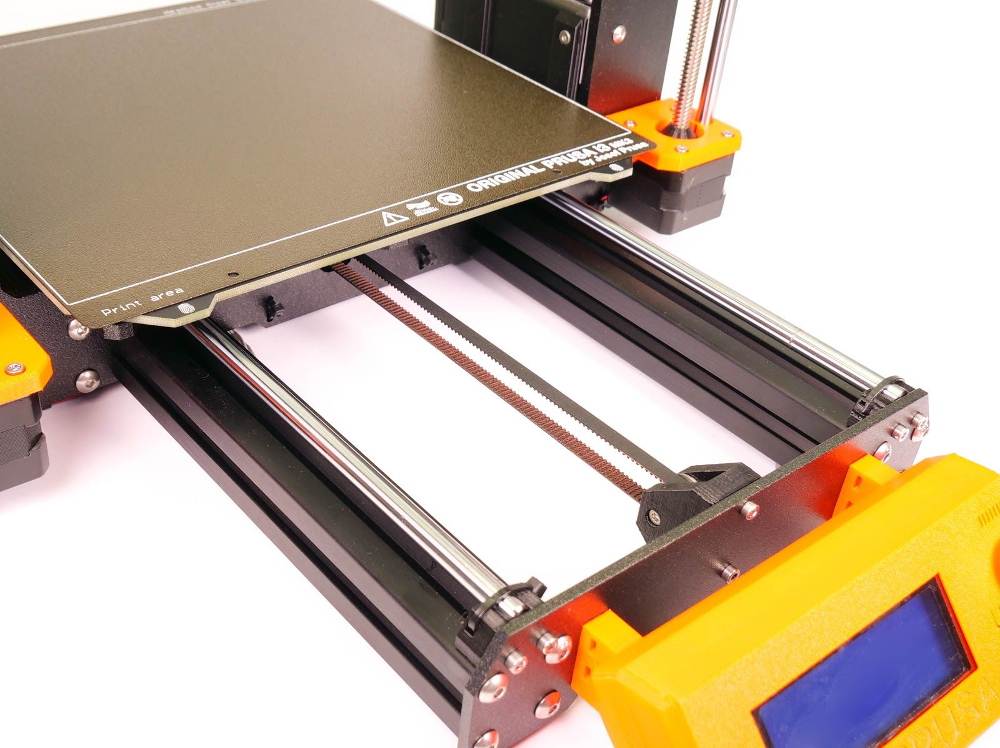
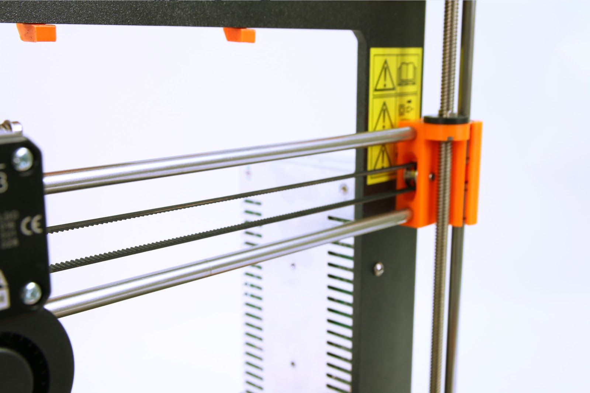
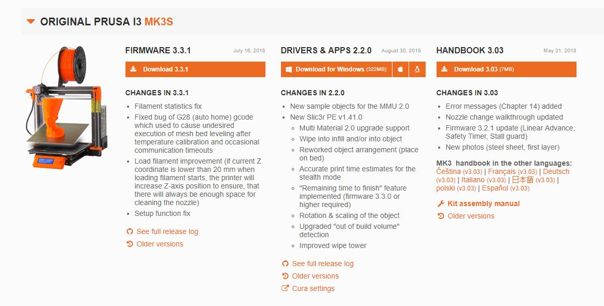
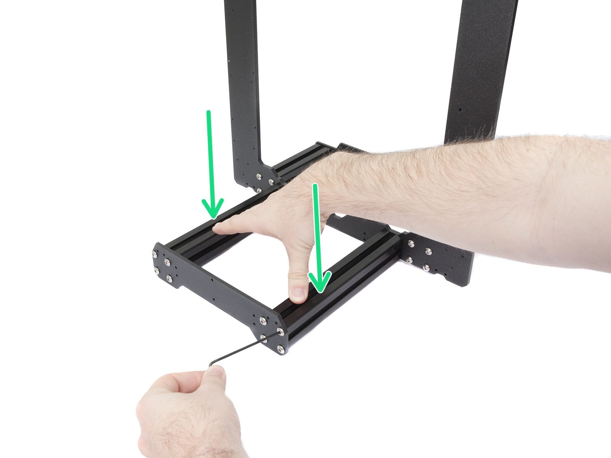
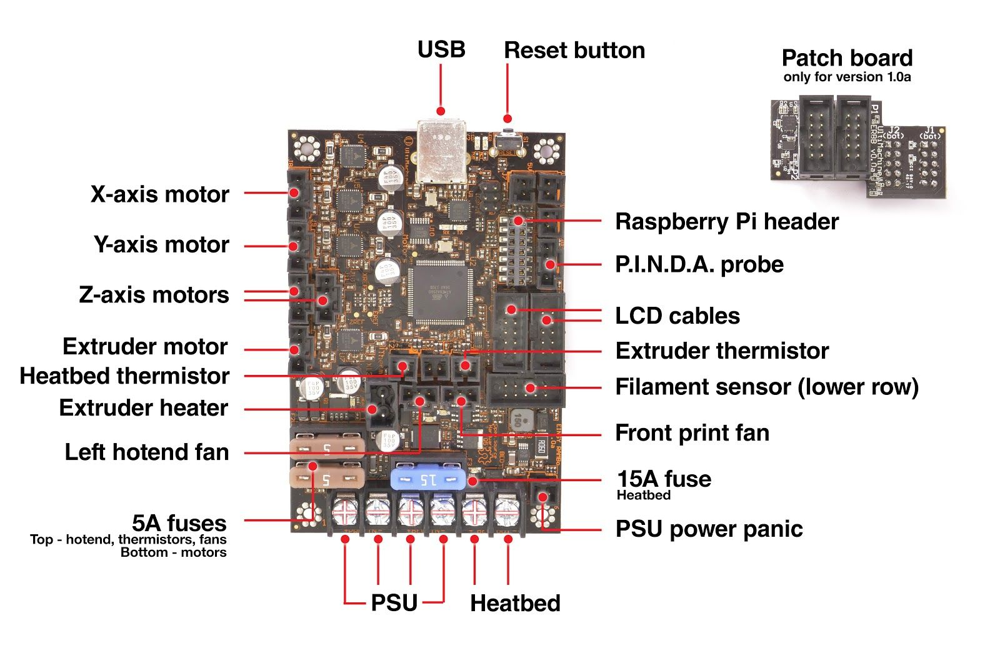
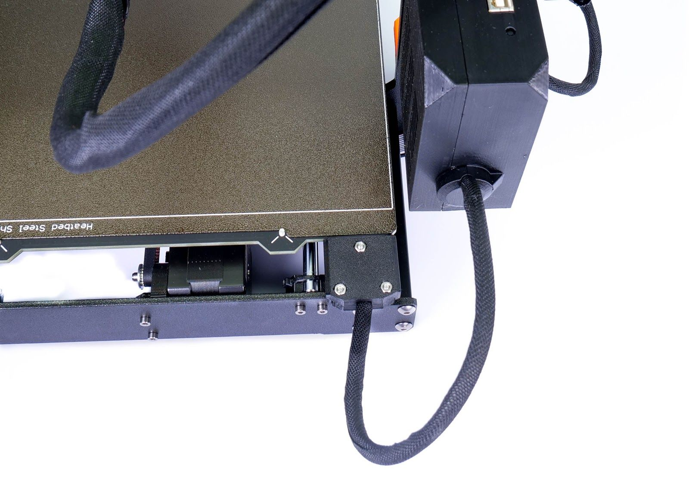

# Module 5 — FAQ & Basic Troubleshooting

  🖨️ Module 5
  ⏱ ~45 min
  🟠 Ongoing

*Content adapted from the Original Prusa MK4S / MK3.9S Handbook §9 and the Original Prusa i3
MK3S Handbook §13–15. © Prusa Research s.r.o. — used for educational purposes.*

In case of a critical failure, the printer may display an error screen with short instructions on
how to proceed. This screen usually contains a link to a detailed article on the knowledge base
at **help.prusa3d.com** as well as a QR code you can scan with your phone. Detailed
troubleshooting guides are always kept online, where they can be updated — the handbook only
covers the basics.

---

## 5.1 Mesh bed leveling fails

Likely causes: the **LoadCell sensor** (MK4S) / **PINDA probe** (MK3S), or a misaligned X/Z axis.

1. Run **Auto Home** and the Z-axis calibration from the Control menu.
2. Move the Z-axis all the way upwards until it hits the endstops — you will hear a couple of
   clicks from the motors. This ensures the horizontal axis is perfectly level.
3. Make sure the print sheet is correctly placed and re-run the calibration.
4. Start the print again.

!!! note "Kit builders"
    If you see homing or mesh-bed-leveling errors on a kit-built printer, there may be an assembly
    issue. Inspect all axes, make sure all screws are tight, and check that the Nextruder and
    heatbed move smoothly with the printer off.

---

## 5.2 Printer does not recognize the inserted USB drive / SD card

=== "MK4S / MK3.9S — USB drive"
    1. Restart the printer first.
    2. If the error **"Error mounting USB drive"** appears, the file system is likely incompatible
       (e.g. exFAT). Use a smaller USB drive (4–16 GB) formatted with **FAT32**, single partition.
    3. Try a different USB drive.
    If several drives fail, there may be a problem with the mainboard — contact support.
    If the drive is recognized but no files appear: use compatible G-code, write the file
    correctly to the drive (use "Safely remove" in Windows), try another drive/file, and try
    renaming the file to something simple, e.g. `model.gcode`.

=== "MK3S — SD card"
    Make sure the file name on the SD card does not contain special characters. If there is no
    error in the file name, check the EXT2 wiring (from electronics to LCD). If the cable is
    connected properly, try swapping the cables.

---

## 5.3 Loose belts

Check both belts to make sure they are properly tensioned. Loose belts cause printing errors or
prevent the printer from starting up. The easiest way to check belt tension is to **print a
circular object** — if the result is not perfectly round, adjust the belt tension (instructions at
help.prusa3d.com).

=== "MK3S — belt status"
    After a successful selftest you can check belt status under **LCD Menu → Support → Belt
    status**. The unitless value should not be under 240 or above 300. Lower value = higher
    tension (higher motor load); higher value = looser belt.

    
    *Source: MK3S Handbook, p. 75 — Y-axis belt under the heatbed.*

    
    *Source: MK3S Handbook, p. 75 — X-axis belt.*

---

## 5.4 Homing failed

Usually caused by a **blockage in one or more axes**.

1. Perform the **Auto Home** calibration from the LCD menu and observe the movements.
2. Make sure the cables leading to the extruder are not touching anything (a wall, shelf, etc.).
3. Make sure nothing is applying pressure onto the heatsink or the extruder motor.

!!! note "Kit builders"
    Inspect the rear side of the extruder and compare the cable bundle to the assembly manual to
    make sure it is not causing incorrect homing.

---

## 5.5 Heating error

If the printer stops and the screen shows a heating-related error, check the connections of the
**heating element and thermistors**. Detailed descriptions can be found at help.prusa3d.com.

---

## 5.6 Fan error

If the printer stops and displays a fan-related error message, check **both fans on the print
head**. It is possible they are not spinning because they got clogged up. If the problem is
elsewhere (e.g. a cable connection), visit help.prusa3d.com.

---

## 5.7 Common error messages (MK3S)

| Error | What it means | What to do |
|-------|---------------|------------|
| **MINTEMP** | Hotend readout drops below 16 °C | Don't run the printer in a room below 16 °C; check thermistor. (MINTEMP BED = heatbed version.) |
| **MAXTEMP** | Readout above 310 °C | Check the thermistor cable for damage; look for overtightened zip-ties. |
| **Thermal runaway** | Temperature drops 15 °C for >45 s (hotend) / >4 min (bed) | Usually a loose thermistor; check connections. Avoid drafts. |
| **Preheat error** | Problem heating up in time | Check that hotend/heatbed thermistors are properly seated. |
| **File incomplete. Continue anyway?** | G-code missing the final M84 command | Most common cause: removing the SD card too early during export. Examine the file; use PrusaSlicer. |
| **PRINT / EXTR. FAN ERROR** | Fan not reporting RPM | Check fans for debris, and the cable connection. |
| **Blackout occurred. Recover print?** | Power went off during printing | Check the object is still attached; resume if safe. |

---

## 5.8 Reverting to an older firmware (MK4S)

Sometimes it is necessary to reinstall an older version of firmware. Upload a file containing the
older firmware onto a USB drive formatted with FAT32. Insert the drive, press the restart button,
and once the printer logo appears press and hold the knob. This activates the firmware update
screen — select **"Flash"** to reinstall the firmware version from the USB drive.

=== "MK3S — firmware via USB cable"
    The MK3S flashes firmware through PrusaSlicer: connect the printer via USB, go to
    **Configuration → Flash printer firmware**, select the firmware file, click **Flash!** and
    wait for the printer to restart.

    
    *Source: MK3S Handbook, p. 72 — firmware and Drivers & Apps packages.*

---

## 5.9 Nozzle hitting the sheet / other Z-axis issues

First make sure everything is properly wired — check the connectors on the electronics board in
the Nextruder. Then perform **Auto Home** on all axes to make sure everything is properly aligned
— the print sheet is correctly placed and the X-axis isn't skewed. Run the LoadCell sensor
calibration again.

---

## 5.10 Kit assembly issues (MK3S)

=== "Printer is rocking on the table"
    Check the **YZ frame geometry**. All parts are machine-cut for precision, but uneven
    tightening can warp the frame. Wiggle the frame sides and check whether corners lift. If you
    find imperfections, release the screws, press the extrusions against a flat surface, and
    tighten them again.

    
    *Source: MK3S Handbook, p. 73 — frame, plates and aluminium extrusion.*

=== "Printer stops printing soon after start"
    The extruder is likely overheated. Make sure the nozzle fan is working properly; if not,
    inspect its connection according to the assembly manual.

    
    *Source: MK3S Handbook, p. 74 — proper wiring of the connectors.*

=== "Cables detached from the heatbed"
    Use a textile sleeve on the heatbed cables and attach them properly so they won't restrict
    movement during printing.

    
    *Source: MK3S Handbook, p. 76 — heatbed cables in a textile sleeve.*

---

## Still stuck?

- **help.prusa3d.com** — knowledge base, print-quality troubleshooting with pictures, and guides
  for component replacement
- **PrusaSlicer G-code Viewer** — check the file is complete before suspecting the printer
- Sample models — if the supplied test prints work but yours don't, the problem is in the slicing
