# Module 1 — Your First Print

  🖨️ Module 1
  ⏱ ~2–3 hrs
  🟢 Fundamentals

*Content adapted from the Original Prusa MK4S / MK3.9S Handbook §4 and the Original Prusa i3
MK3S Handbook §6–7. © Prusa Research s.r.o. — used for educational purposes.*

In this module you will learn how to:

- Control the printer
- Prepare the print sheet for the first print
- Perform initial calibration
- Insert filament
- Start the first print
- Remove the print
- Troubleshoot basic issues
- Update the firmware

---

## 1.1 Basic controls

**MK4S / MK3.9S** — You can control the printer using both the touchscreen and the rotary knob
next to it. Rotate the knob to select items on the screen and press it to confirm your selection.
The reset button is located under the rotary knob. Pressing the reset button is the same as
quickly turning the printer off and on again. It is useful in cases where it is necessary to
immediately stop an action that the printer is currently performing.

**MK3S** — Controlling the LCD screen is done by a single control element: a rotational knob
that you press to confirm the selection. By single pressing the control button on the information
screen, you enter the main menu. The reset button is placed directly under the control knob;
pressing it equates to quickly toggling the power switch. During some LCD functions (such as the
Calibration Wizard) you may encounter special symbols in the bottom right corner: a **double
down arrow** means the message contains more screens which switch automatically, and a
**tick sign** means you need to press the control knob to continue.

!!! tip "Shortcut"
    On the MK3S, press and hold the control knob for 3 seconds for quick access to the
    **Move Z axis** function.

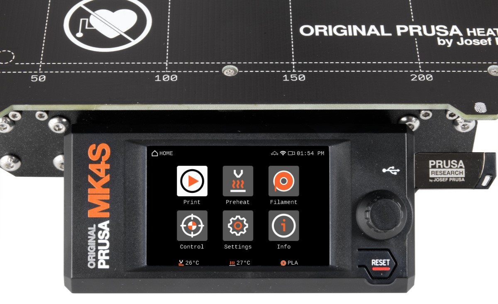
*Source: MK4S Handbook, p. 16 — basic controls and printer overview.*

---

## 1.2 Preparing flexible print sheets

If you have ordered a pre-assembled printer, a print sheet with a **test print** will already be
installed on the printer. The test print must be removed before proceeding to the next step:
remove the print sheet and carefully bend it on both sides. Then turn it by 90° and repeat the
bending until the print separates from the print sheet. Then place the sheet back on the printer.

!!! danger "Before you install the sheet"
    Make sure there is **no debris on the heatbed** before you install the print sheet. It could
    throw off the first layer calibration or possibly even damage your printer. Do not drag the
    print sheet while it's attached with magnets — you could scratch and damage the heatbed. If
    you need to readjust the print sheet, always lift it up by grabbing the front two corners,
    adjust its position and then place it back down.

There are **high-temperature magnets** embedded into the heatbed that hold the removable
flexible print sheets in place. On the back of the heatbed you will find **two pins** that fit
exactly into the cutout of the print sheet. Before installing the sheet, make sure it is perfectly
clean.

!!! warning "Never print directly on the heated bed"

Attach the sheet by first aligning the rear cutout with the locking pins on the back of the heated
bed (marked in orange). Hold the sheet by the front two corners and slowly lay it down onto the
heated bed — watch your fingers!

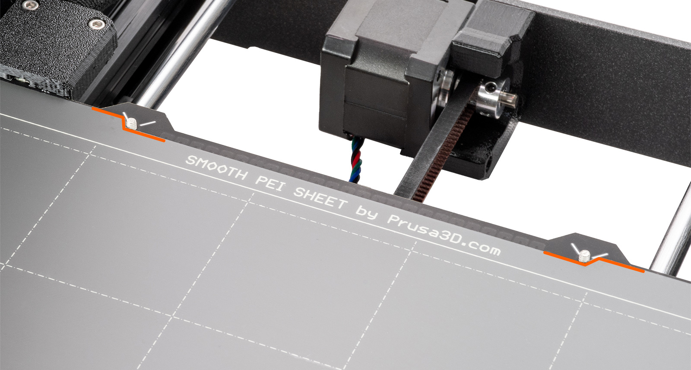
*Source: MK4S Handbook, p. 17 — attaching the flexible print sheet.*

For your first print, it is enough to wipe the bed using the supplied cleaning wipes soaked with
**isopropyl alcohol**. Do this now, but make sure not to touch the surface of the sheet
afterwards.

=== "MK4S / MK3.9S — standard sheet"
    The MK4S comes standard with a **double-sided smooth PEI print sheet**. If you have a
    different type, study how to properly treat the surface in the Regular Maintenance chapter.

=== "MK3S — sheet options"
    The MK3S ships with a smooth PEI sheet, but textured powder-coated sheets are widely used.
    The two surfaces print differently — see the comparison below and the Material Guide.

    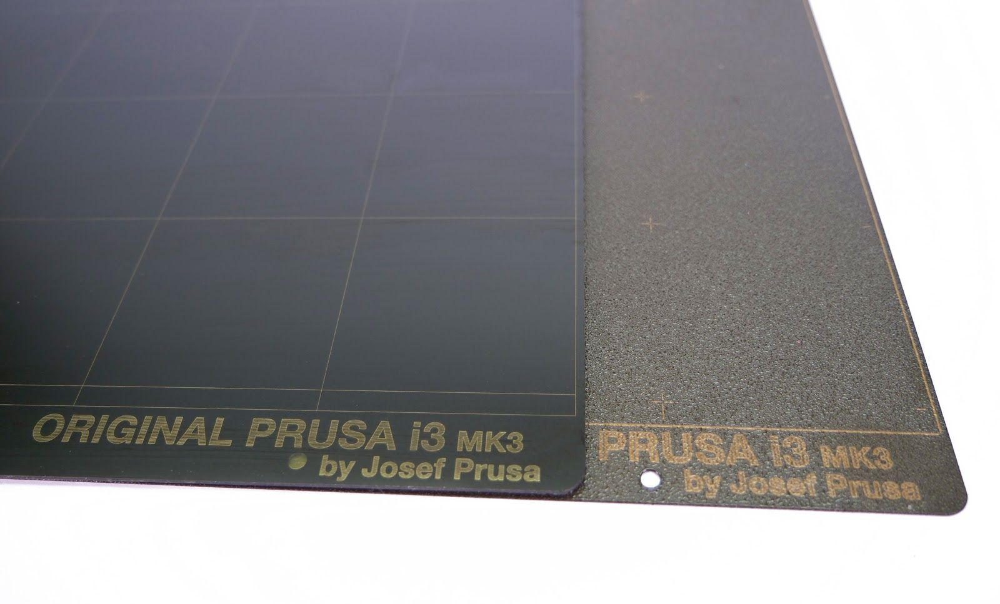
    *Source: MK3S Handbook, p. 14 — steel print sheets: smooth PEI and textured powder-coated PEI.*

    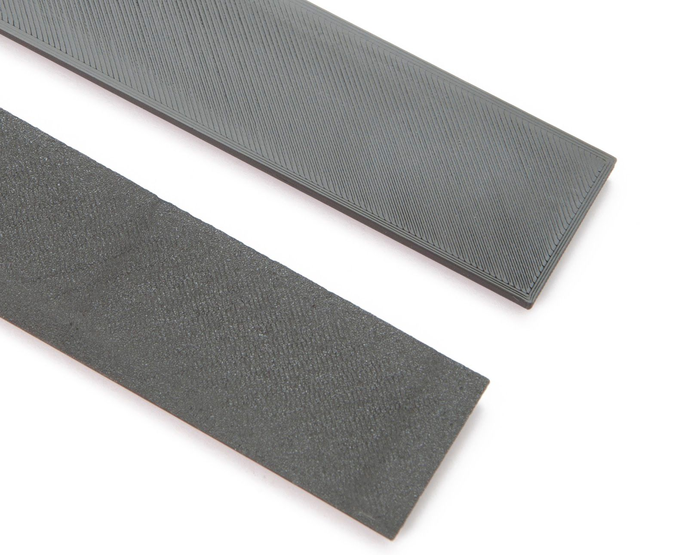
    *Source: MK3S Handbook, p. 15 — smooth PEI (top) vs textured powder-coated PEI (bottom) effect on the first layer.*

!!! note "Consumables"
    Print sheets are **consumables** and are not covered by warranty unless they arrive damaged
    or incorrectly manufactured. The warranty only applies to defects that appear immediately
    after unpacking. All original print sheets made by Prusa Research are **double-sided**.

---

## 1.3 Selftest (Calibration Wizard)

!!! warning "The print sheet must be installed onto the printer before the calibration!"

When you first power on the printer, the **Selftest (Calibration wizard)** will start. The wizard
walks you through the initial calibration and all necessary tests to start printing. Completing
the entire checklist is mandatory.

The first thing the wizard performs is the **internet setup configuration**. This is completely
optional and you may choose to skip this step — the printer is fully functional in offline mode.
Follow the simple steps on the screen to connect the printer to the network.

The wizard provides text descriptions and illustrations of the individual steps. It is designed to
make the process as automated and understandable as possible. You can also start the Selftest
manually using the LCD menu — **Control → Run Full Selftest** (MK4S) or **Calibration → Wizard**
(MK3S).

!!! info "Purpose of the calibration"
    The purpose of the calibration is to check whether your printer is in good shape. If you built
    the printer as a kit, the Selftest checks for basic assembly issues. If you ordered a
    pre-assembled printer, the Selftest can help identify issues that could be caused by rough
    handling during shipping. It's a one-time process that doesn't need to be repeated before
    every print. Rerun it if you encounter issues with your printer.

=== "MK4S / MK3.9S"
    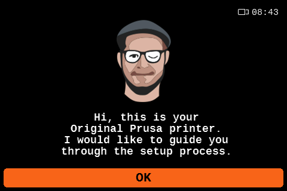
    *Source: MK4S Handbook, p. 18 — the Selftest (Calibration wizard).*

=== "MK3S"
    Before running the Wizard, read **1.2 Preparing flexible print sheets**. The MK3S Wizard
    follows the calibration flow: Selftest → Calibrate XYZ → Loading the filament → First layer
    calibration. It is not mandatory to use it — you can cancel the Wizard at the beginning and
    follow the calibration flow manually.

    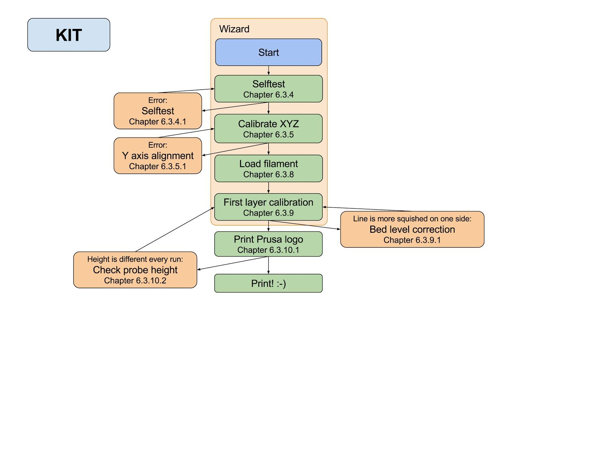
    *Source: MK3S Handbook, p. 12 — Wizard setup.*

    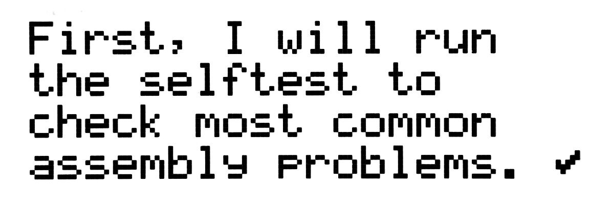
    *Source: MK3S Handbook, p. 12 — quick guide.*

There are a few special occasions where you will need to redo the calibration or a part of it:

- **Firmware update**
- **Readjusting the probe** (MK3S) — run *Calibrate Z* to store new reference Z height values

!!! warning "MK3S: disconnect USB before calibrating"
    Disconnect the printer USB from any computer or OctoPrint for the whole calibration. During
    calibration the printer will not respond to a host connected via USB, and communication will
    time out — which can reset the printer mid-calibration and leave it in a weird state requiring
    a factory reset.

---

## 1.4 Running the Selftest

!!! danger "During the Selftest, do not manipulate or touch the printer unless the calibration asks you to."
    If the printer is placed on an unstable surface, or if there is another running 3D printer
    next to it, the accuracy of the calibration may be affected. The printer should be placed on
    a stable surface.

For the Selftest and the filament sensor calibration, you will need **at least 5 cm (2 in.) of
filament** — though it is simpler to prepare an entire spool of PLA so you can start printing as
soon as the Selftest finishes.

The Selftest is a set of various tests that serve as a diagnostic tool. The progress and results
of each test are displayed on the LCD. If the Selftest detects an error, the testing is interrupted
and the cause of the error is displayed on the screen.

=== "MK4S / MK3.9S — tasks performed"
    - Test of heatsink fan and print fan
    - Test of the X, Y, and Z axis
    - Gearbox alignment
    - Heater tests
    - LoadCell test
    - Network connection (optional)
    - Setting up the filament sensor (insert a piece of filament into the slot on the top of the extruder)

    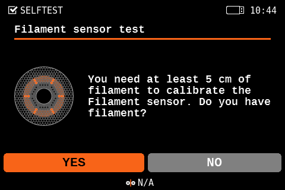
    *Source: MK4S Handbook, p. 19 — Selftest progress on the LCD.*

    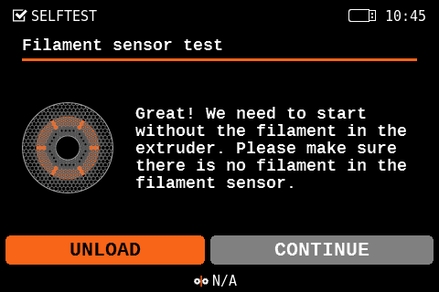
    *Source: MK4S Handbook, p. 19 — filament sensor calibration.*

=== "MK3S — selftest components (kit)"
    - Extruder and print fan test
    - Heatbed and hotend proper wiring
    - XYZ motors proper wiring and functionality
    - XY axis length
    - XY belts tension
    - Loose belt pulley test
    - Filament sensor test

    The MK3S selftest is primarily a diagnostic tool for **kit-built** printers; assembled printers
    are pre-tested at the factory. If you are certain the affected part is correct, you may continue
    with the print process even after a selftest failure.

---

## 1.5 Inserting (loading) filament

First, prepare a spool of filament — **PLA is strongly recommended** for your first print because
it is easy to work with. Take the spool, make sure the end of the filament is properly secured,
and place it onto the spoolholder on top of the printer's frame.

Carefully unhook the end of the filament strand and make sure not to let go — otherwise the
tension in the strand would cause the filament to quickly tangle up.

=== "MK4S / MK3.9S"
    1. Cut the end of the filament into a **sharp point**. Push the filament through the hole in
       the filament guide and insert the strand into the opening at the top of the Nextruder. If
       the filament sensor is on, the filament will be automatically fed. If the filament sensor
       is off, proceed to step 2, otherwise skip to step 3.
    2. Select **LCD Menu → Filament → Load Filament** and confirm with the button.
    3. The **Preheat** menu will automatically appear. Select the material of the filament you
       want to insert and confirm the selection.
    4. Wait until the nozzle reaches the desired temperature.
    5. Select **Continue** to start feeding the filament. Push the filament into the Nextruder
       lightly until you feel that the extruder gear has grabbed the filament and is pulling it in.
    6. The feed wheel pushes the filament further into the extruder. Once it heats up fully, it
       will push out a bit of material from the nozzle. The printer will ask if the color of the
       extruded filament is okay (**Yes / Purge More / Retry**):
       - Filament extruded and color correct → **YES**
       - Not extruded, or contaminated with another color → **PURGE MORE** (repeatable)
       - PURGE MORE doesn't help → **RETRY** the loading procedure

    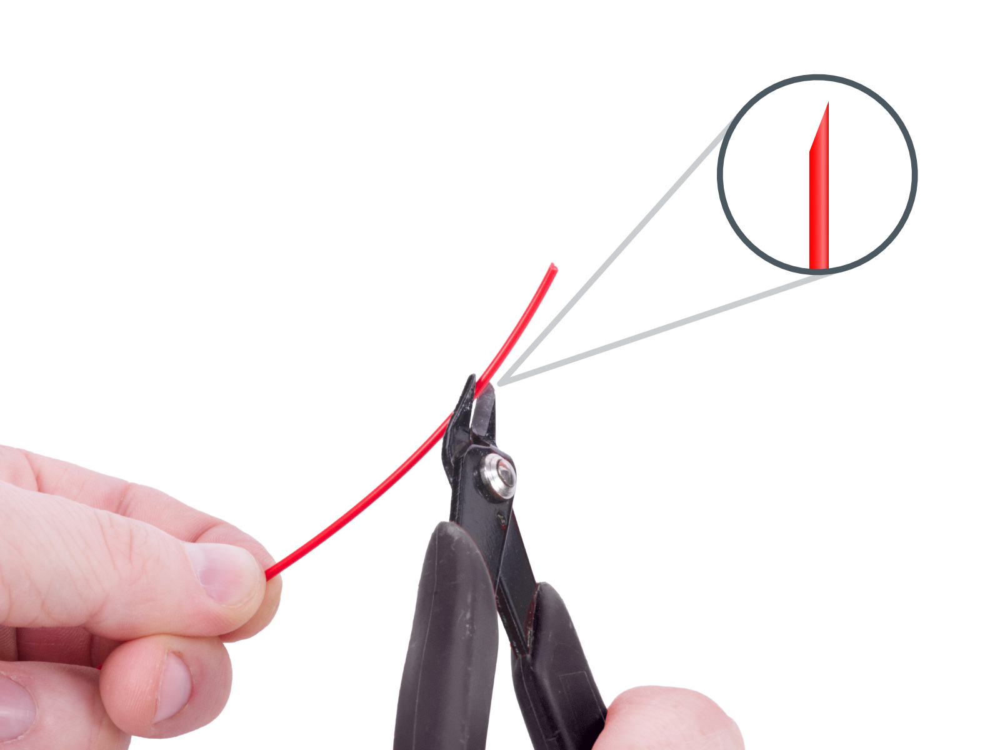
    *Source: MK4S Handbook, p. 20 — inserting filament into the Nextruder.*

    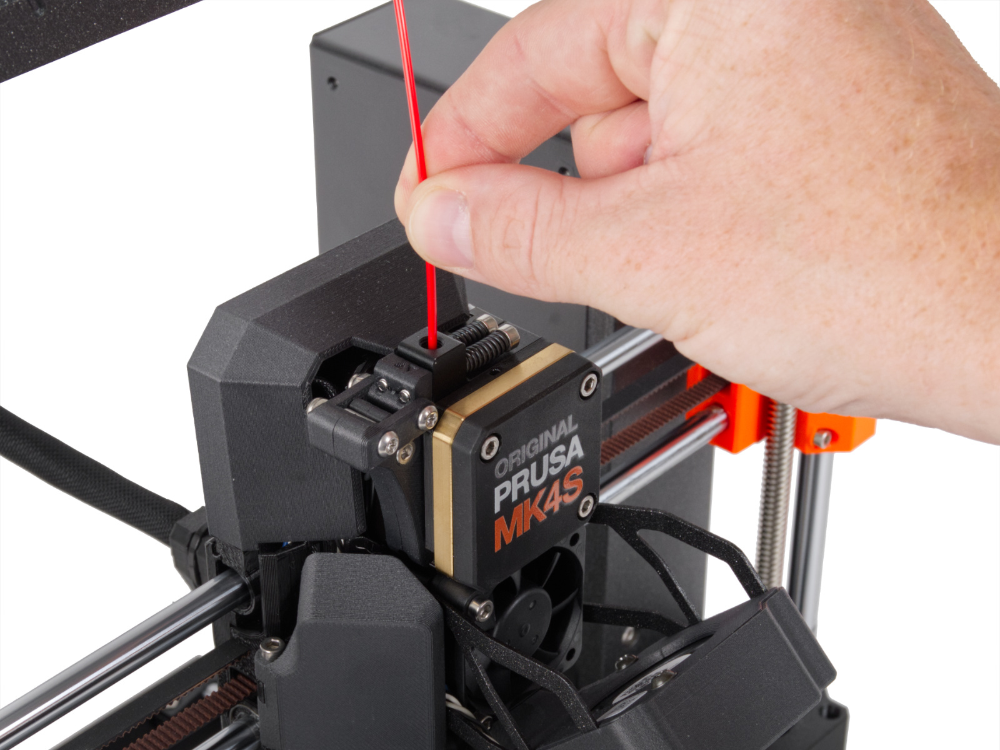
    *Source: MK4S Handbook, p. 20 — filament insertion point.*

    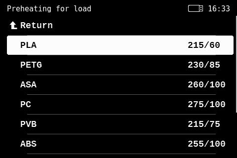
    *Source: MK4S Handbook, p. 21 — Filament menu.*

    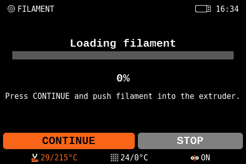
    *Source: MK4S Handbook, p. 21 — the printer remembers the inserted filament.*

    !!! note ""
        The printer **remembers** which filament is inserted into it even when you turn it off.
        The type of filament is displayed in the lower section of the LCD menu.

=== "MK3S"
    Before you can load the filament, the printer must be preheated for the correct filament type.

    1. Press the control knob on the LCD panel to enter the main menu.
    2. Insert the filament into the extruder.
    3. Choose **Load filament** in the menu and press the button to confirm.
       - If the nozzle is not preheated, the preheat menu will be automatically shown — select
         the filament type and confirm.
       - Wait for the nozzle to reach the target preheat temperature.
       - Insert the filament into the extruder and confirm loading.
    4. The filament is then loaded to the extruder by the extruder stepper automatically.

    If the **filament sensor and autoloading are enabled**, preheat the printer and simply insert
    the filament into the extruder — everything is automated from that point. Make sure the
    filament tip is nice and pointy. The Z-axis will rise if the current Z coordinate is less than
    20 mm from the print bed, ensuring there is always enough space for cleaning the nozzle.

    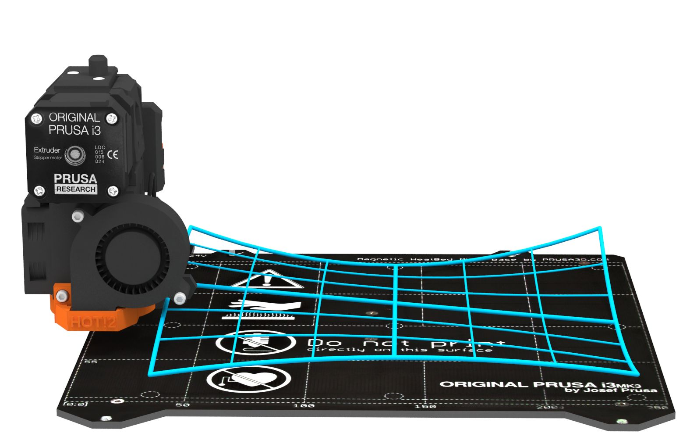
    *Source: MK3S Handbook, p. 23 — loading the filament into the extruder.*

    !!! tip "Always check the filament is flowing from the nozzle"
        If you change the filament for a different one, completely remove the old filament first by
        extruding from **LCD Menu → Settings → Move axis → Extruder** until the color is
        completely changed.

---

## 1.6 Unloading (removing) filament

=== "MK4S / MK3.9S"
    1. Select **LCD Menu → Filament → Unload Filament**.
    2. The printer will preheat automatically. As soon as it reaches the right temperature, the
       filament will be unloaded from the extruder in a few seconds.
    3. Once the extruder stops unloading, remove the filament from the extruder by hand. The
       filament needs to be wound up on the spool and secured carefully so it does not tangle up.

=== "MK3S"
    Select **Unload filament** from the menu. If the nozzle is not preheated, the preheat menu is
    shown automatically — select the filament type and confirm. After the printer reaches the
    target temperature, press the knob to unload the filament. If the nozzle was already
    preheated, the filament is unloaded immediately.

    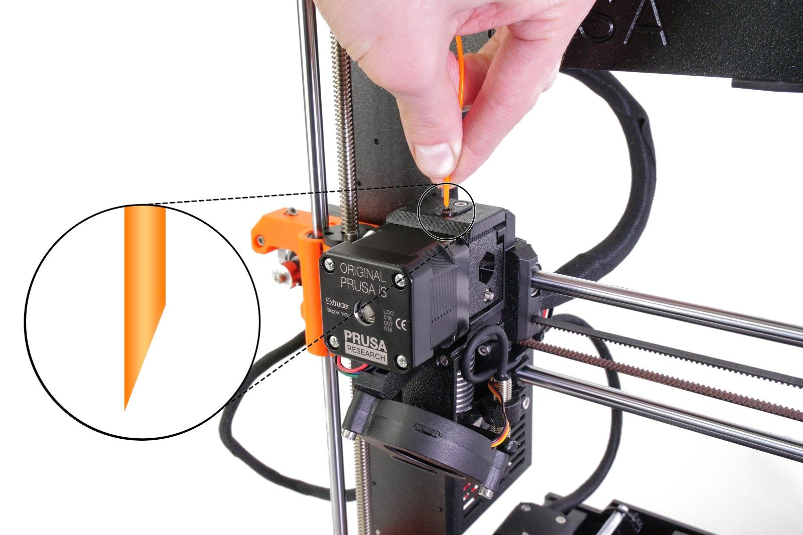
    *Source: MK3S Handbook, p. 24 — unloading the filament.*

!!! tip "Tangled filament? Let's fix it!"
    If you accidentally let go of the end of the filament and the strand quickly retracts onto the
    spool, it's possible the filament became tangled. This poses a risk during printing — a knot
    can form on the strand, which will inevitably lead to a failed print. Simply remove the spool
    from the spoolholder and start unwinding the filament strand until you find the crossed
    section. Fix it and wind the filament back onto the spool.

    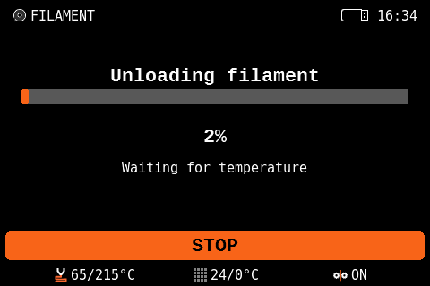
    *Source: MK4S Handbook, p. 22 — fixing a tangle.*

---

## 1.7 Starting the First Print

If you haven't done it already, clean the print sheet with the enclosed wipe saturated with
**isopropyl alcohol**, or spray a bit of isopropyl alcohol onto the sheet and wipe it clean with a
paper towel. Note that the enclosed wipe has limited use as IPA evaporates quickly.

Then select one of the test objects from the **Print menu** (only appears if a USB drive is
inserted — MK4S; on the MK3S, press the LCD knob and choose **Print from SD**). Confirm the
selection by pressing the rotary knob.

Watch the printer closely during the first print. The **Keychain** test object is recommended —
it gives you a good quick overview of whether everything is properly set up. The nozzle first
preheats to **170 °C** independently of the selected filament — the temperature is lower to
prevent the filament from dripping from the nozzle.

Then the printer performs **Mesh Bed Leveling** — the nozzle checks the distance to the print
sheet in several places to create a virtual height map of the surface. This allows the printer to
lay down a perfect first layer every time. Subsequently, the printing of the object or objects
takes place.

=== "MK4S / MK3.9S"
    Optionally, if you have more than one color of PLA filament, you can also select the
    **Dual-Color Keychain**. It's a great demonstration of a multi-colored print using only one
    extruder. During the print, the machine will ask you to change the filament — follow the
    instructions on the screen.

    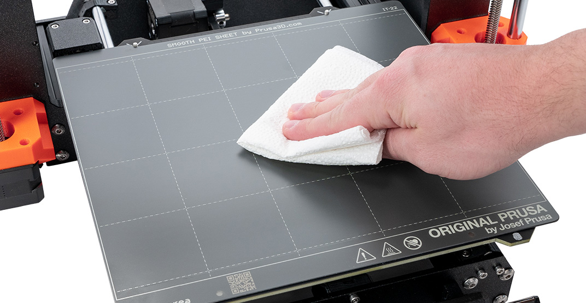
    *Source: MK4S Handbook, p. 23 — the test objects.*

=== "MK3S"
    Make sure the nozzle and the bed are heated to the desired temperature. If you forget to
    preheat, the printer automatically checks the temperatures and printing will start when the
    desired temperature is reached — that can take several minutes.

    Watch the **first few printed layers** to be sure the filament has attached to the bed
    properly (5 to 10 minutes).

    !!! warning "Do not let the preheated printer idle"
        When a printer is preheated and non-printing, material in the extruder degrades over
        time — it may cause the nozzle to jam up.

    !!! note "Filenames"
        The filename (.gcode) must not contain any special characters, otherwise the printer is
        not able to display the file on the LCD.

Carefully observe the quality of the **first layer**. The MK4S is equipped with very accurate
**LoadCell technology**, which measures the distance between the nozzle and the bed with perfect
accuracy. However, it may happen that due to, e.g., traces of grease, the print may not hold
well.

!!! danger "If the plastic is peeling off the bed"
    Stop the print by selecting the **Stop print** icon on the screen. Clean the bed and try
    again.

If the first print fails repeatedly, go to the **First Print Troubleshooting** section below.

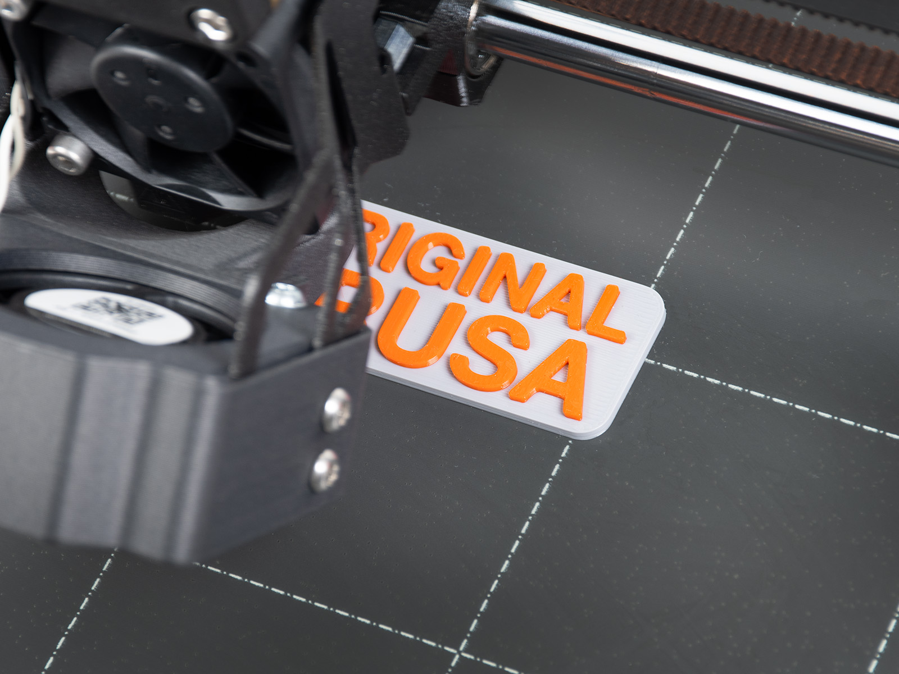
*Source: MK4S Handbook, p. 24 — watching the first layer.*

---

## 1.8 Removing a printed object from the print sheet

Once the print job is finished, **wait until the print sheet cools down**. The print plate and
heated bed may exceed 100 °C, depending on the settings — contact with unprotected skin can
cause burns, so check the heatbed temperature in the footer of the LCD screen!

Depending on the type of material, the print may separate from the print sheet automatically by
itself after cooling. If not, remove the print plate and carefully **bend it on both sides**. Then
turn it by 90° and repeat the bending. Be sure to remove all pieces of plastic — don't forget the
priming line next to the print.

=== "MK4S / MK3.9S"
    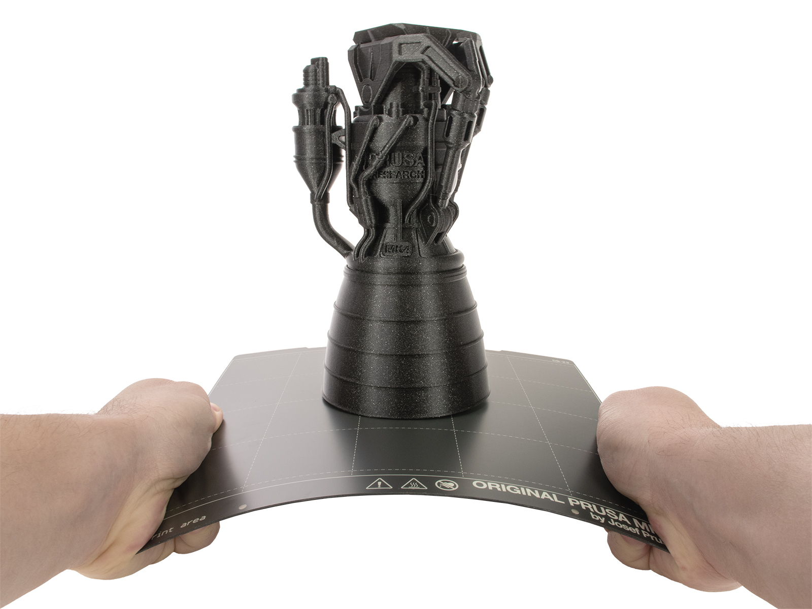
    *Source: MK4S Handbook, p. 25 — removing a printed object by bending the sheet.*

    !!! danger "Do not use your nails"
        If there are plastic remnants on the plate, do not remove them with your nails — you could
        get injured. Use a plastic spatula to remove the remaining plastic.

=== "MK3S"
    When the printing is finished, let both nozzle and heatbed cool down before removing the
    printed object. Always handle printed objects when the temperature of the bed and nozzle
    drop to room temperature. When the bed is hot, objects are very hard to remove. Remove the
    steel sheet from the printer and bend it slightly; prints should pop off. If you experience
    troubles removing an object (especially small ones), use a flat tool like a spatula **with
    rounded corners** to prevent damage to the PEI. Slide the spatula under the corner of the
    object and gently push until the print pops off.

    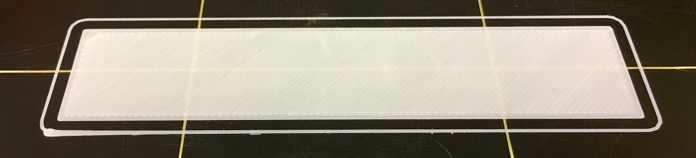
    *Source: MK3S Handbook, p. 27 — removing the model from the PEI surface by bending the steel sheet.*

!!! tip "Try not to touch the print surface with your fingers — fingerprints are greasy and can reduce adhesion."

---

## 1.9 Selftest Troubleshooting

If you built the printer using the assembly kit, it's possible you missed a step in the
walkthrough or forgot to connect something. No worries — fixing an issue is actually pretty
straightforward. Just follow the instructions on the screen.

The Selftest identifies common and even less common issues with your printer with great
accuracy. The firmware can recognize whether the fans, heating elements, sensors and other
components respond as they should, and raises an error when they don't.

- If you see a **heating-related error** during the Selftest, make sure the print sheet is placed
  on the heatbed as described in the previous chapters.
- If you need to check a connection or disassemble any part of the printer, follow the link on
  the error screen or visit **help.prusa3d.com** for a relevant help article.

=== "MK3S — selftest error messages (kit)"
    | Error | Solution |
    |-------|----------|
    | Front print fan / Left hotend fan — not spinning | Check the wiring of the print and hotend fan cables; ensure both are connected to the EINSY electronics and not swapped. |
    | Please check / Not connected — Heater / Thermistor | Check the hotend power cables and thermistor cables; ensure they are connected and not swapped. |
    | Bed/Heater — wiring error | Check that the heatbed and hotend power cables (and both thermistor cables) are not swapped in the EINSY electronics. |
    | Loose pulley — XY | Tighten the first grub screw on the flat piece of the shaft, then the second grub screw. |
    | Axis length — XY | The print head might be blocked from moving all the way. Check by hand that the print head moves smoothly with the printer off. |
    | Endstops — wiring error — Z | Check the PINDA probe cabling. |
    | Endstop not hit — Motor Z | Check the print head can move all the way down the Z axis to trigger the PINDA probe over the bed. |
    | Filament sensor — wiring error | Check the filament sensor cable for damage and correct connection to the EINSY board. |

---

## 1.10 First Print Troubleshooting

The calibration and pre-print setup are fully automated — the filament is automatically inserted,
axes checked and the first layer precisely measured. If a printing issue does occur, it usually
falls into one of the following scenarios:

### 1.10.1 LoadCell calibration fails

**Solution:** This usually happens when you tap the nozzle too briefly or with not enough force.
Repeat the calibration and push the nozzle a bit harder.

### 1.10.2 First layer peeling off from the bed

**Solution:** The most common cause is **grease on the bed** or an unsuitable combination of
material and print surface (e.g. PLA and a textured sheet).

Make sure the sheet is sufficiently degreased using isopropyl alcohol — more information can be
found in the Regular Maintenance chapter and in the Material Guide. Water with a bit of dish
soap is also an option if you don't have access to IPA — make sure to clean and dry the sheet
thoroughly to prevent rusting.

### 1.10.3 Nozzle moves too high/low, or extrudes plastic outside the print area

**Solution:** Make sure the print sheet is properly installed and that nothing is blocking the
X/Y/Z axes.

If the print sheet is not installed properly (e.g. not aligned with the heatbed), it may cause
various printing issues. Make sure nothing obstructs the movement of the axes and that all
packaging material and transport fixations have been removed. Run the **Auto Home** calibration
from the menu to test all three axes. Another possibility is that the LoadCell sensor is not
performing as expected — make sure the LoadCell sensor cable is properly connected and repeat
the **LoadCell Test** from the Control menu.

!!! note "Kit builders"
    Double-check the parts on the X (horizontal) and Z (vertical) axes against the official
    assembly manual. Make sure the screws securing the motors are tightened correctly.

### 1.10.4 The nozzle does not start extruding, even after multiple attempts

**Solution:** Make sure the filament can reach the extruder gear inside the Nextruder and that
the nozzle is not clogged.

First of all, load the filament exactly as described in the Loading Filament chapter. Once the
loading procedure is completed, unlock the **idler door** on the extruder by lifting the small
clamp, then flip the door open and see if the filament strand reached the large extruder gear. If
it didn't, something is blocking the movement of the filament. If the filament appears
completely loaded (it goes across the extruder gear towards the nozzle), the nozzle might be
blocked. If you hear the extruder gear **clicking** during purging, it may be a sign the nozzle is
blocked.

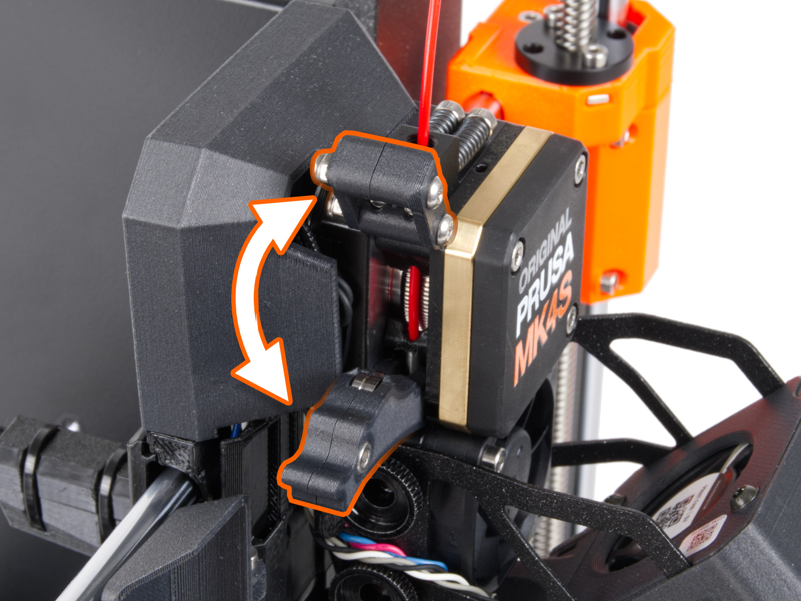
*Source: MK4S Handbook, p. 28 — inspecting the filament path through the extruder.*

!!! note "Kit builders"
    If you over-tightened the screws on top of the extruder, the idler may be so tight that
    filament won't pass through. Open the idler and double-check that the filament can reach the
    gear. Decrease the idler pressure by loosening the two screws on top of the Nextruder.

### 1.10.5 After a few hours of printing, the nozzle stops extruding filament

**Solution:** First, check if the filament isn't tangled. If it's not the case, unload it, wait for
the printer to cool down and then remove the hotend from the extruder (see help.prusa3d.com for
exact instructions) and check if the **steel filament guide** isn't deformed. This might happen
when you overtighten the thumbscrews. Another possibility is that the nozzle is clogged or
blocked.

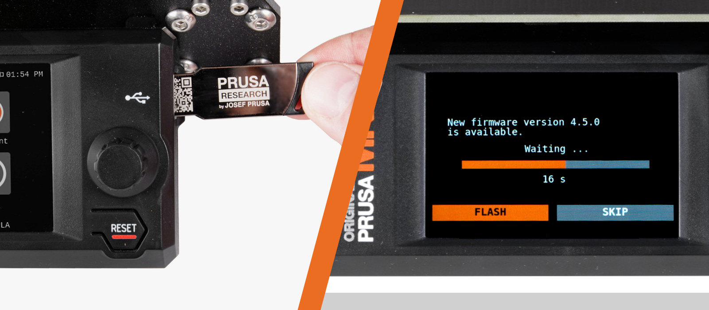
*Source: MK4S Handbook, p. 29 — the hotend assembly.*

---

## 1.11 Updating the Firmware

To make sure you have the most up-to-date version of the firmware with the latest features and
settings, check **prusa3d.com/drivers**. You can perform the firmware update after you complete
the initial Selftest. To check your firmware version, navigate to **LCD Menu → Info → Version
info**.

=== "MK4S / MK3.9S — via USB"
    1. Download the correct version of the firmware from prusa3d.com/drivers and unzip the file.
    2. Copy the **.BBF** file to a USB drive formatted with FAT32 — you can use the USB drive
       that comes with the printer.
    3. Insert the USB drive into the printer.
    4. Restart the device using the reset button (located under the rotary knob).
    5. The update process should begin automatically. Confirm flashing by selecting **FLASH** and
       pressing the knob.
    6. Wait until the process is completed.

    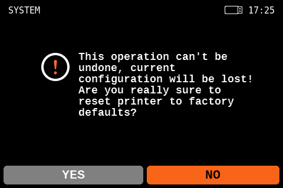
    *Source: MK4S Handbook, p. 30 — confirming the firmware flash.*

    !!! tip "Forcing a firmware installation"
        To force a firmware installation (e.g. to load an older firmware), insert the USB drive
        containing the desired .BBF file, restart the printer, wait for the logo to show up and
        press and hold the control button during system startup until the firmware installation
        screen appears.

=== "MK3S — via USB cable"
    Flashing the MK3S requires a **USB 2.0 Type B cable**, PrusaSlicer and the correct firmware
    file. Windows users should install the latest Drivers & Apps package from prusa3d.com/drivers
    (select "Drivers" and "PrusaSlicer"). MacOS/Linux users download only PrusaSlicer.

    To flash: connect the printer to your PC via USB, start PrusaSlicer, go to **Configuration →
    Flash printer firmware**, check your printer is recognized, browse to the firmware file, click
    **Flash!** and wait. The printer restarts when finished.

    Remember: firmware files are **different for each model**.

---

## 1.12 Sample Models

The USB drive (MK4S) or SD card (MK3S) that came with the printer contains a number of sample
files (G-codes). Keep them on the flash drive — they have been prepared (sliced) and thoroughly
tested. If you encounter issues with print quality at any time, try loading and printing one of
the sample files, especially the **Prusa Logo Keychain**. These sample files are designed to test
the basic functionality of your printer.

If your own custom print fails and the sample files print correctly, there is probably an issue
with the way your files are **sliced**. Try reslicing them again with the default PrusaSlicer
settings and check for the basic issues:

- Incorrect printer/nozzle profile (the MK4S is equipped with a 0.4 mm nozzle by default)
- Incorrect material settings
- Missing supports
- Incorrectly configured infill
- The model is not in contact with the print sheet

If the sample files are not printed correctly, check the Troubleshooting section, the knowledge
base at help.prusa3d.com, or contact tech support.

### Factory Reset

If you feel like you changed settings that have negatively affected your 3D printer, you can
always revert to factory default values and try again. Factory Reset is done via **LCD Menu →
Settings → System → Factory Reset** (MK4S). This resets all saved values to their default state.

---

## In your words — Module 1 reflection

- [ ] List the steps you performed during the Selftest. Which test would detect a loose belt?
- [ ] Why must the print sheet be free of grease before the first layer?
- [ ] What does Mesh Bed Leveling do, and why does it happen before every print?
- [ ] Write one paragraph explaining how to tell whether a peeling first layer is a bed-surface
      problem or a slicing problem (use 1.12 as a hint).
