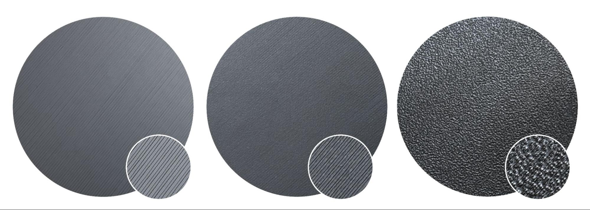
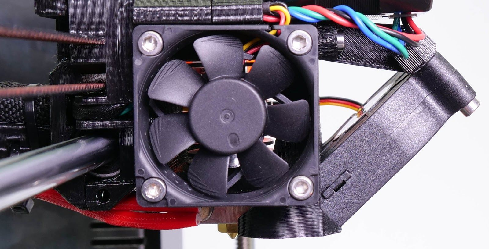
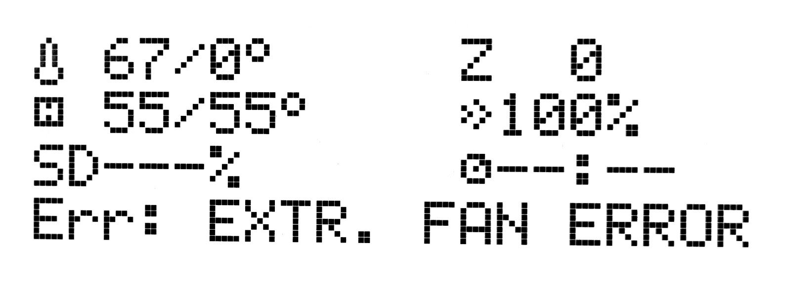
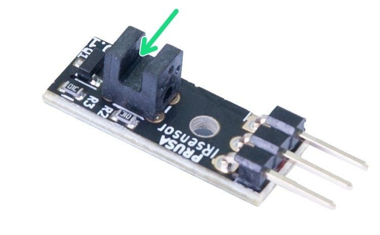
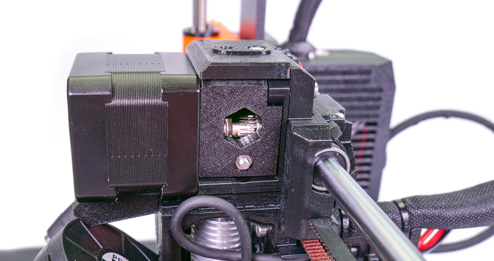
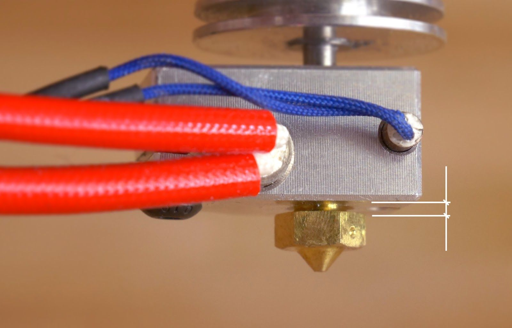
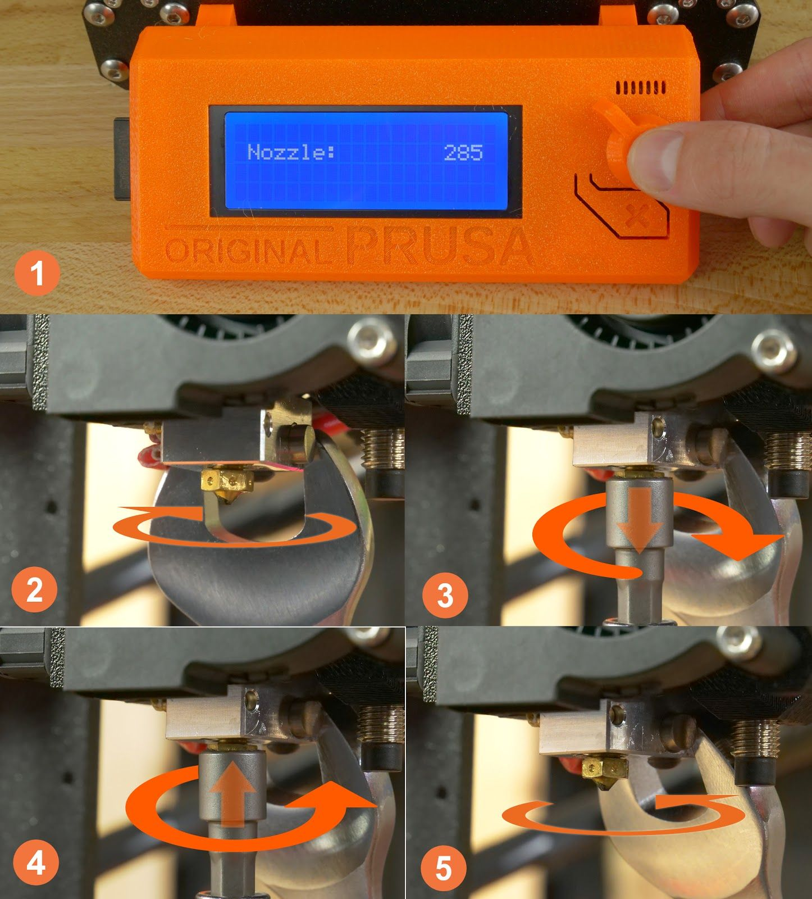
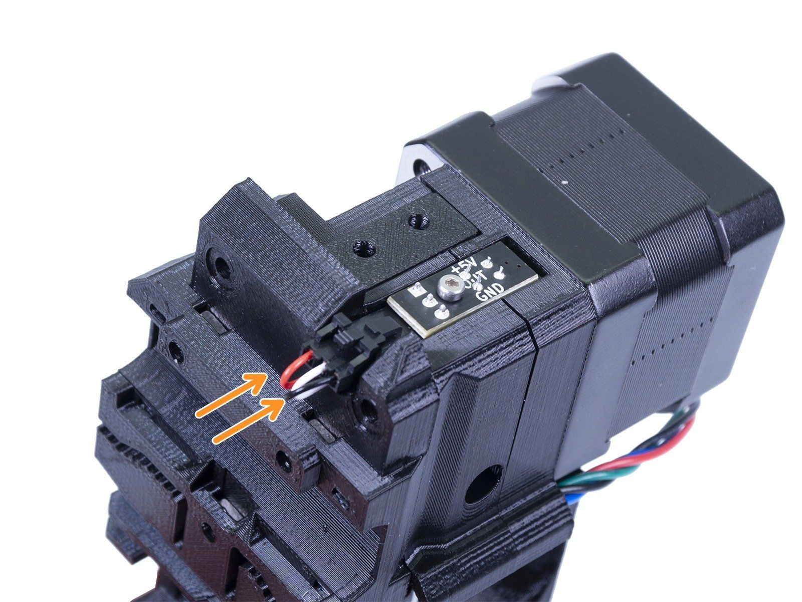
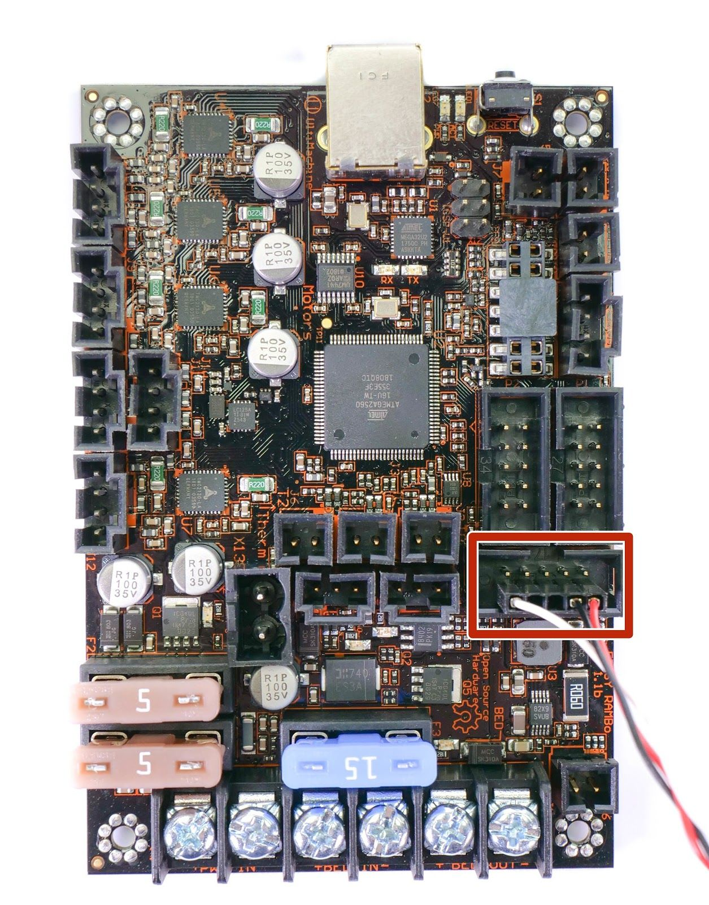

# Module 4 — Regular Maintenance

  🖨️ Module 4
  ⏱ ~1 hr
  🟠 Ongoing

*Content adapted from the Original Prusa MK4S / MK3.9S Handbook §8 and the Original Prusa i3
MK3S Handbook §13.1–13.6. © Prusa Research s.r.o. — used for educational purposes.*

The printer was designed from the beginning as a true print "workhorse". Despite its high
reliability, it is still a device with mechanical components that require more or less regular
maintenance. Follow the instructions below to keep your printer in perfect condition for as long
as possible.

---

## 4.1 Flexible print sheets

To achieve the best adhesion of the print surface, it needs to be kept clean. Choose the right
cleaning agent depending on the type of print sheet (see below). Drop a small amount of the agent
onto a clean paper towel and wipe the print surface. **Best results are achieved when the print
sheet is cold** — otherwise you may burn yourself on the nozzle or heated bed, and the alcohol
will evaporate before it has a chance to clean anything.

*Source: MK4S Handbook, p. 57 — the effect of various print sheets on the first layer, from left to
right: smooth, satin and textured powder-coated.*

!!! note "How often to clean"
    The print surface does not need to be cleaned before every print — just be aware of not
    touching it with your fingers.

### Cleaning agent by sheet type

| Print sheet | Correct usage | Risks and dangers |
|-------------|---------------|-------------------|
| **Smooth PEI** | Isopropyl alcohol 90 %+ (IPA) is the best option for degreasing (do not use dermatological hand products that may contain IPA with other additives). Warm water with a few drops of dish soap (in case IPA doesn't remove residues like sugar). Acetone occasionally for a thorough clean. | PETG prints stick too strongly to an IPA-cleaned sheet and removing them can damage the surface. Materials such as PETG, ASA, ABS, PC, CPE, PP and FLEX should only be printed with a separating layer (glue stick). |
| **Textured powder-coated** | Isopropyl alcohol 90 %+ (IPA) — best for degreasing. | **Do not use acetone.** |
| **Satin** | Suitable for PLA and PETG. 90 % isopropyl alcohol (IPA) is the best degreaser. For printing flexible filaments you need a separating layer of glue (Kores). Broad spectrum of supported materials, including advanced materials such as PC Blend. | **Never use acetone!** For ASA and PC Blend you need to add a brim, outline or shield around the print. Do not use sharp objects to remove the print from the bed. |

!!! warning "Consumables"
    Consumable materials such as print sheets are not covered by warranty unless they arrive
    damaged or incorrectly manufactured. All original print sheets made by Prusa Research are
    **double-sided**.

### 4.1.1 Double-sided TEXTURED print sheet

- Surface resistant to damage and scratches
- The texture is transferred to the bottom side of the printed object
- Simpler Z-axis calibration
- FLEX does not require glue application to the print bed
- After the print sheet cools down, the print usually detaches itself
- PLA prints with a small contact area may require a **brim**
- Large PLA prints may warp
- **Never clean with acetone**

The textured powder-coated surface applied directly to metal creates a print sheet highly
resistant to damage. If a heated nozzle hits it, the metal quickly dissipates the heat. The
texture gives the bottom surface of the print a unique, interesting finish and masks most
scratches and similar types of damage caused by tools.

!!! danger "Never use acetone on the textured surface"
    This will cause micro-cracks in the PEI layer, which will eventually lead to a significant
    deterioration of the surface quality.

### 4.1.2 Double-sided SMOOTH print sheet

- Excellent for PLA
- Great adhesion to almost all materials
- Smooth bottom layer of prints
- Even small prints will hold well
- Occasionally clean with acetone

For printing materials such as PETG, ASA, ABS, PC, CPE, PP, Flex and others, it is necessary to
apply a **glue separation layer**. More information can be found in the Material Guide.

!!! note "Bubbles under the PEI"
    The industrial adhesive used to attach the PEI layer to the sheet tends to soften at
    temperatures above 110 °C, and can move beneath the surface, creating small bumps. If you
    notice small bubbles beneath the PEI layer, just flip the sheet over and print on the other
    side. After a few days or weeks, the bubbles should disappear — they have no effect on print
    quality.

=== "MK3S — PEI rejuvenation"
    PEI can lose its adhesive powers after a couple hundred hours. **Wipe it thoroughly with
    acetone** when you see models getting loose to restore the adhesion. Small shiny marks left
    by the nozzle or tools don't affect adhesion — they can be gently polished with the hard side
    of a dry kitchen sponge.

### 4.1.3 Double-sided SATIN print sheet

- Suitable for PLA and PETG
- Soft texture on the bottom part of the print
- Only use quality isopropyl alcohol (90+ %) to clean
- FLEX requires a glue separation layer (Kores / PVA glue stick)
- Wide range of supported materials, including advanced materials such as PC Blend
- Easy maintenance and good adhesion
- **Do not use acetone** — it will damage the surface
- When printing with ASA and PC Blend, a brim or raft may be required around the print, depending
  on model height
- Do not use sharp metal objects to remove prints (e.g. a metal spatula)

### 4.1.4 Improving the adhesion

In certain special cases — such as printing a very tall object that touches the print sheet with
a very small area — it may be necessary to improve adhesion. PEI is a chemically very resistant
polymer, so it is possible to apply various substances to improve adhesion without risking damage
to the surface. This also applies to various materials whose adhesion to PEI would be very weak
under normal circumstances. More information can be found at help.prusa3d.com/materials.

=== "MK3S — adhesion boosters"
    - **Brim** (PrusaSlicer) — increases the surface area of the first layer; consider this before
      applying anything to the bed
    - **Glue stick** — the trick for Nylon blends; remove later with window cleaner or dish soap
    - **ABS juice** — for ABS prints; apply gently on a cold bed, clean with pure acetone. Prints
      attach very strongly

!!! tip "Before applying anything, consider using the Brim feature in PrusaSlicer to increase the area of the first layer."

---

## 4.2 Keeping the printer clean

After several hours of printing, various kinds of debris may start to accumulate around the
printer parts or under the heatbed — pieces of filament, dust, scraps, broken supports, etc.
Always make sure the parts of the printer are clean. You can use a **brush, a small broom or a
vacuum** to remove debris.

---

## 4.3 Bearings

Every couple hundred hours, the smooth rods should be cleaned with a paper towel. Then apply a
little bit of the included lubricant to the smooth rods and move the axis back and forth a couple
of times. This cleans the dirt and increases longevity.

If you feel the axis is not running smoothly anymore, bearings can be taken out and greased on
the inside — they need to be removed from the axis because the plastic lip will prevent most of
the grease from getting inside.

=== "MK3S"
    The MK3S handbook specifies **general purpose machine oil** for the smooth rods and, for
    removal, **Super-lube or any other multi-purpose grease**.

---

## 4.4 Fans

The RPM (revolutions per minute) of both fans is constantly measured. The printer will report an
**error** if a fan suddenly slows down — for example due to a piece of filament stuck in it. In
such a case, check and remove any dirt from the relevant fan. Do not try to bypass the RPM check
— this could damage the printer!

Both fans should be checked and cleaned after every few hundred hours of printing. Dust can be
removed with **compressed air** in a spray can; small plastic threads can be removed with
**tweezers**. Do not blow compressed air on a running fan.

=== "MK3S"
    The MK3S nozzle cooling fan is made by **Noctua** — premium fans known for superb quietness
    and exceptional performance. You can turn off fan monitoring in **LCD Menu → Settings → Check
    fans** (e.g. if you replaced a fan with one that does not support RPM sensing).

    
    *Source: MK3S Handbook, p. 64 — nozzle cooling fan from Noctua.*

    
    *Source: MK3S Handbook, p. 64 — fan error on the LCD.*

---

## 4.5 Extruder feeding gear

The feeding gear in the extruder does not need any lubricant. Over time, a **filament powder
deposit** may form in the grooves, causing poor extrusion of filament. Remove the debris using
compressed air in a spray; small plastic threads can be removed with tweezers. Use the access
opening on the side of the extruder. Clean as much as possible, then turn the wheel (**LCD Menu →
Control → Axis**) and continue.

!!! warning "Never open the gearbox"
    Never, under any circumstances, open the gearbox itself unless you have the gearbox alignment
    tool that comes with the MK4S assembly kit. There is no need to open the gearbox cover.

=== "MK3S — Bondtech gears"
    The Bondtech extruder gears can build up filament shavings in the grooves and cause
    under-extrusion. A small **brass brush** is ideal to clean the grooves (a toothpick will do).
    Check and clean from the access window on the right side of the extruder assembly — nothing
    needs to be disassembled. Clean when you see signs of missing plastic in objects, e.g. missing
    lines of extrusion.

    The gears are hardened carbon steel. As the gear meshing section is constantly turning during
    operation, it needs lubrication to reduce wear and noise — **a lithium-based grease** is
    recommended. **Oil is not recommended** since it might spread to the section where the filament
    is fed to the hotend.

    
    *Source: MK3S Handbook, p. 67 — the hobbed pulley visible through the service hole.*

---

## 4.6 Electronics

It is a good practice to check and optionally reconnect the electrical connectors on the
mainboard.

=== "MK4S / MK3.9S"
    Check the connectors on the xBuddy board and electronics board in the Nextruder every
    **600–800 hours** of printing.

=== "MK3S"
    Check the connectors on the EINSY RAMBo board after the first **50 hours** of printing and
    then every **150–200 hours**.

---

## 4.7 Clogged / jammed extruder

Clogged extruders can cause issues when printing or when loading a new filament.

=== "MK4S / MK3.9S"
    On top of the extruder there is a pair of screws directly next to the filament insertion
    point — you can adjust the **idler pressure** by loosening or tightening these screws. By
    unlocking the top clip you can open the idler and check the filament track for blockages.
    When the idler is open, clean the feed gear of all filament remnants. We recommend regularly
    cleaning the gear.

=== "MK3S"
    1. Heat the nozzle, remove the filament from the extruder, and cut the rod about 10 cm above
       the damaged part.
    2. Clean the extruder through the service hole on the right side (access to the hobbed pulley).
    3. Clean the hobbed pulley, then heat the nozzle before reloading the filament.
    4. If the problem persists, you will have to clean the nozzle (see 4.8).

---

## 4.8 Cleaning the nozzle

!!! danger "Do not touch the nozzle during this procedure — it is hot and there is a risk of burning yourself!"
    To better access the extruder during cleaning, raise the extruder to the top of the Z-axis in
    the LCD menu (**Control → Movement → Z Axis** / **Settings → Move axis → Move Z axis**).

### 4.8.1 The filament does not come out of the nozzle

If the filament does not pass through the extruder and no plastic is being extruded, check the
following:

- Open the idler on the side of the extruder to see if the filament strand reached the extruder
  gear and continues down into the nozzle
- See if the temperatures are set correctly (215 °C for PLA, 260 °C for ASA, etc.)
- Check if the fan on the side of the extruder is spinning

If the filament strand is not visible (does not reach the extruder wheel), the problem is likely
near the filament entry point or the filament sensor. Inspect the path of the filament and see if
the filament sensor isn't stuck.

### 4.8.2 The filament does not come out, or only a small amount comes out

1. Heat the nozzle to the appropriate temperature for the filament material (or slightly above).
   First feed the filament, then insert an **acupuncture needle** (included in the package) or
   thin wire (0.3–0.35 mm) into the nozzle from the bottom to a depth of about 1–2 cm. Use
   protective gloves in case material suddenly starts to come out of the nozzle.
2. Select **Load Filament** from the LCD menu and check that the nozzle is actually extruding.
3. Insert the wire or needle again and repeat the whole procedure several times. If the filament
   is extruded correctly, the nozzle is clean.

If the filament still doesn't come out and the nozzle is clogged, you can perform a **cold pull**
method to clean the insides of the nozzle — the **Cold Pull wizard** is in the printer's LCD menu.

=== "MK3S — hotend clog clearance"
    If none of the filament is going through, your hotend is most likely clogged:
    1. Heat the nozzle to 250 °C for PLA or 270 °C for ABS jams.
    2. Wait 3–5 minutes, then go to **LCD Menu → Load filament**. If the clog is cleared, lower
       the temperature to normal and re-do the load.
    3. If the filament loads successfully, you can resume printing.

    
    *Source: MK3S Handbook, p. 68 — nozzle cleaning.*

### 4.8.3 Replacing / changing the nozzle (MK3S)

1. Preheat the nozzle to **285 °C** — heating is essential!
2. Unload any loaded filament.
3. Move the extruder axis as high as possible.
4. Unscrew the fan nozzle shroud (one screw).
5. Hold the heater block with a 16 mm spanner and unscrew it a little (about 45° is enough) to
   avoid damaging the thread on the other side.
6. Using the supplied pliers, or preferably a 7 mm socket, unscrew the nozzle. **The nozzle is
   still hot!**
7. Screw the new nozzle in and tighten it, holding the heater block with the spanner.
8. Tighten the heater block back to its original position.
9. Reassemble the fan-nozzle shroud, insert filament, and you are ready to print.

*Source: MK3S Handbook, p. 70 — the gap between nozzle and heater block is normal.*

*Source: MK3S Handbook, p. 70 — nozzle change.*

!!! warning "After changing the nozzle"
    Run the first layer calibration after changing the nozzle. When the nozzle is fully screwed
    in there is still a small gap between it and the heater block — that's normal; do not try to
    overtighten the nozzle to get rid of it. Be careful around the hotend thermistor leads (they
    break easily) and never bend the heatbreak.

---

## 4.9 Filament sensor (MK3S)

The MK3S uses a mechanical IR-based filament sensor. It detects running out of filament and is
used for filament **AutoLoad**.

### Running out of filament

Running out of filament will no longer cause a print failure. The printer automatically pauses
the print, unloads the remaining few centimeters in the heatbreak, and moves the X-carriage away
from the print. You are prompted to replace the spool and insert new filament. Use pliers to
remove the filament extruded during loading. After that, you can continue the current print.

### False sensor readings and debugging

Check the sensor in **LCD Menu → Support → Sensor info**: when you insert filament into the
extruder, the IR state should be "1"; when you unload and remove it, the state should change to
"0". Possible causes of wrong readings:

- **Wiring problem** — check the connectors on both sides of the sensor cable
- **Incorrectly seated IR sensor** — see the assembly manual
- **Dust on the sensor** — clean with a can of compressed air
- **Defective IR sensor** — contact support

*Source: MK3S Handbook, p. 66 — properly connected and seated filament sensor.*

*Source: MK3S Handbook, p. 66 — the IR filament sensor.*

=== "MK4S / MK3.9S"
    The filament sensor is calibrated during the initial Selftest and can also be re-calibrated
    from the printer's **Control** menu. If you encounter random readings, unload the filament,
    turn the printer off and remove debris from the Nextruder — either using tweezers or a can of
    compressed air.

---

## In your words — Module 4 reflection

- [ ] Which print sheet type requires a separating layer for PETG, and why?
- [ ] Why must you never clean the textured sheet with acetone?
- [ ] Describe the RPM-checking feature of the fans and what a fan error means.
- [ ] Write the step-by-step procedure for clearing a clogged nozzle.
