# Module 2 — Printing Your Own Models

  🖨️ Module 2
  ⏱ ~2 hrs
  🟢 Fundamentals

*Content adapted from the Original Prusa MK4S / MK3.9S Handbook §6 and the Original Prusa i3
MK3S Handbook §10–11. © Prusa Research s.r.o. — used for educational purposes.*

Your printer should now be fully calibrated and your first print a success. Now you want to print
your own model — be it something you already modeled, or something you downloaded from the
internet.

Here's a little catch: **it's not possible to print models downloaded from the internet directly.**
Before you can print a model, you need to prepare it for the printer — we call this process
**"slicing"**. Generally speaking, you need to tell the printer what should be inside the printed
object (**infill**), how detailed the model should be, and a couple of other things. Plus, you
need to keep in mind several things like the stability or durability of the print.

**To summarize the workflow:**

1. Find a suitable 3D object for printing and download it (usually in `.stl`, `.3mf` or `.obj` format)
2. Import the object into PrusaSlicer — www.prusaslicer.com
3. Select the nozzle diameter (default is 0.4 mm) and layer height
4. Use the built-in tools to **scale, move and rotate** the object. Find the optimal orientation:
   - Large flat base
   - Minimal overhang angles to reduce the number of supports required
   - If supports are necessary, rotate the object so supports are not in direct contact with
     areas that need top print quality (e.g. the face of a statue)
5. Select the infill type and density
6. Slice the object
7. Inspect the preview
8. Export the G-code and print it

---

## 2.1 Obtaining printable models

The easiest way to start with 3D printing is to download models from the internet — they are
usually in `.3mf`, `.stl` or `.obj` formats. There are many enthusiasts in the 3D printing world,
so a large number of models are available for free — from a simple die to detailed figures from
your favorite games, movies and series; mechanical parts, RC accessories, various household
items, and even massive complex projects.

=== "MK4S / MK3.9S — recommended sites"
    - **www.printables.com** — a large online library managed by Prusa Research, with
      high-quality models, community contests, and a built-in 3D model viewer for STL, 3MF and
      G-code files
    - www.thingiverse.com
    - www.myminifactory.com
    - www.gambody.com

    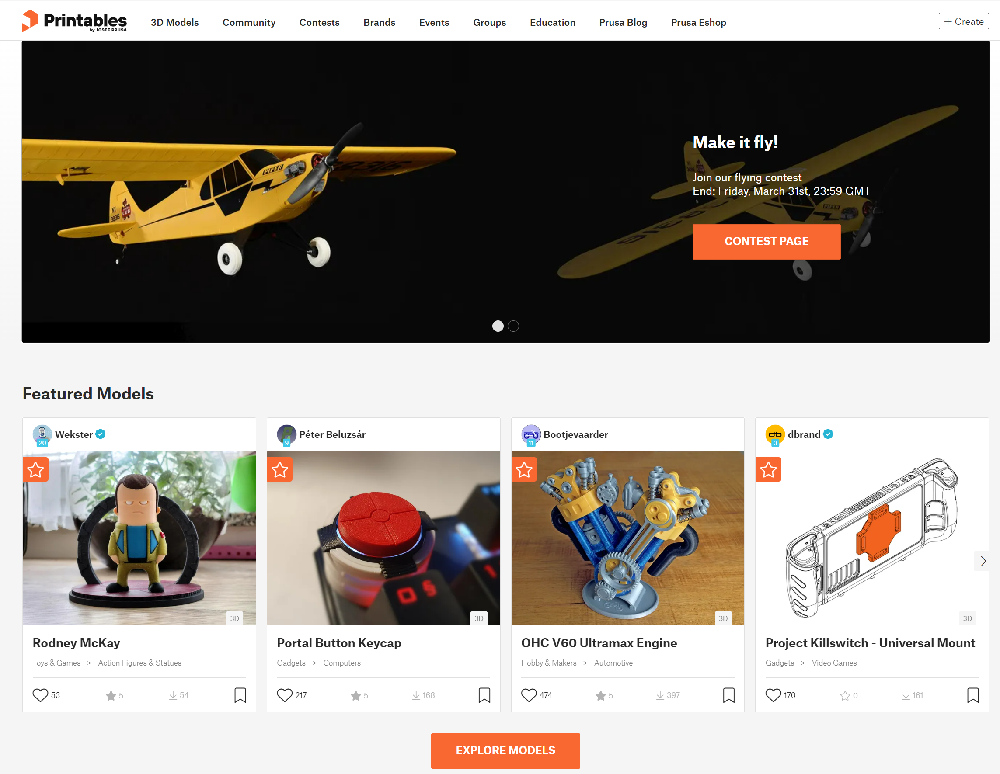
    *Source: MK4S Handbook, p. 39 — Printables.com model library.*

=== "MK3S — recommended sites"
    - www.prusaprinters.org — the only G-code database on the entire internet; download
      perfectly tweaked G-codes and skip slicing, or reslice STL/3MF yourself
    - www.thingiverse.com
    - www.myminifactory.com
    - pinshape.com
    - www.youmagine.com
    - cults3d.com

Models are usually available either **free** under the **Creative Commons — Attribution —
Non-Commercial License** (models cannot be used commercially and must always include the
author's name), or for a small fee.

!!! note "You cannot print STL/OBJ directly"
    Models in `.stl`, `.obj` etc. formats cannot be printed directly. First, these files need to
    be **sliced** (prepared for printing), which results in a **G-code** file containing the
    actual instructions for the printer. You place the G-code on a USB drive (or SD card), insert
    it into the printer, and start printing. You will find out more in sections 2.3 and 2.4.

---

## 2.2 Create your own model

To create your own 3D model, you need a special program — a **3D editor**.

- **Tinkercad** (www.tinkercad.com) — an online editor that runs in your browser window, with no
  installation required. It is free, intuitive, and there are a lot of tutorials available online.
  Tinkercad is mainly focused on the creation of less detailed and larger (mechanical) parts,
  ideal for FFF/FDM printing.
- **Autodesk Fusion 360** (www.autodesk.com/products/fusion-360) — for PC, Mac and iPad. A
  simple guide and detailed video tutorials make it an ideal choice for both beginners and
  professionals. Check the Prusa Academy for beginner tutorials at
  prusa3d.com/category/prusa-academy.
- Other programs (MK3S handbook): OpenSCAD, DesignSpark Mechanical, Blender, Maya, 3DS Max,
  AutoCAD and many more.

*Source: MK3S Handbook, p. 46 — creating models in Fusion 360.*

---

## 2.3 What is a G-code file?

3D models you have created or downloaded need to be converted from their original format (`.stl`,
`.obj`, `.3mf`, etc.) into a file containing specific instructions for the printer — the
**G-code**. This is the format that 3D printers can understand. It contains instructions about
the movement of the nozzle, the amount of filament to be extruded, temperature settings, fan
speeds and more.

There are dozens of different slicers available, each with its own advantages and disadvantages.
Among Prusa printer owners the most commonly used are:

- **PrusaSlicer** (recommended)
- **Cura**
- **Simplify3D**

---

## 2.4 PrusaSlicer

PrusaSlicer (prusaslicer.com) is Prusa's in-house developed slicer, based on the open-source
project **Slic3r**. It is open-source, feature-rich and frequently updated, and contains
everything you need to export the perfect print files for (not only) your Prusa printer. The
standout features are:

- Clean and simple UI
- Fine-tuned print and material profiles with automatic updates
- Precise print time/feature analysis
- Customizable supports and modifiers
- Built-in shape gallery
- Variable layer height
- Color painting
- Various print settings

PrusaSlicer is completely free for everyone — it even includes profiles for 3rd party printers.
It also comes with a **G-code Viewer**, a lightweight application you can use to preview G-codes
from all popular slicers.

!!! tip "Download PrusaSlicer"
    The latest stable version is always available at **prusaslicer.com**. Development
    alpha/beta versions can be downloaded from github.com/prusa3d/PrusaSlicer — these are
    unstable builds with the latest features.

---

## 2.5 PrusaSlicer interface explained

=== "MK4S / MK3.9S — current interface"
    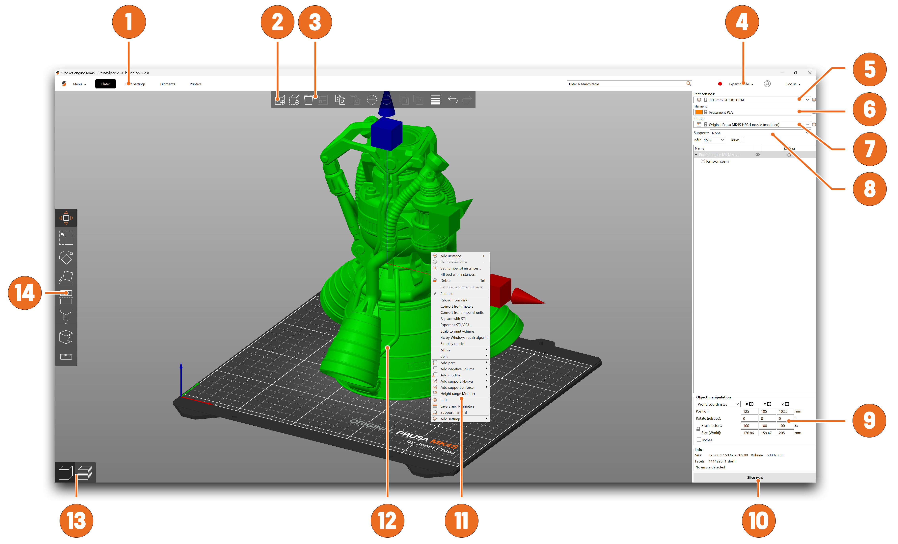
    *Source: MK4S Handbook, p. 42 — PrusaSlicer interface.*

    1. Opens detailed **Print, Filament and Printer** settings
    2. The **Add** button imports a 3D model into the scene
    3. The **Delete** and **Delete All** buttons remove model(s)
    4. Switching between **Simple, Advanced and Expert** modes
    5. Settings for printing **speed and quality**
    6. **Material** selection
    7. **Printer** selection
    8. Quick settings for **Infill density, Supports and Brim**
    9. Information about model size / printing time (after slicing)
    10. **Slice / Export** button
    11. Right-click the model to open a context menu
    12. Model preview in 3D
    13. Switch between **3D editor** and **Preview** mode
    14. **Move, Scale, Rotate, Cut, Paint-on Supports, Seam Painting** tools

=== "MK3S — interface"
    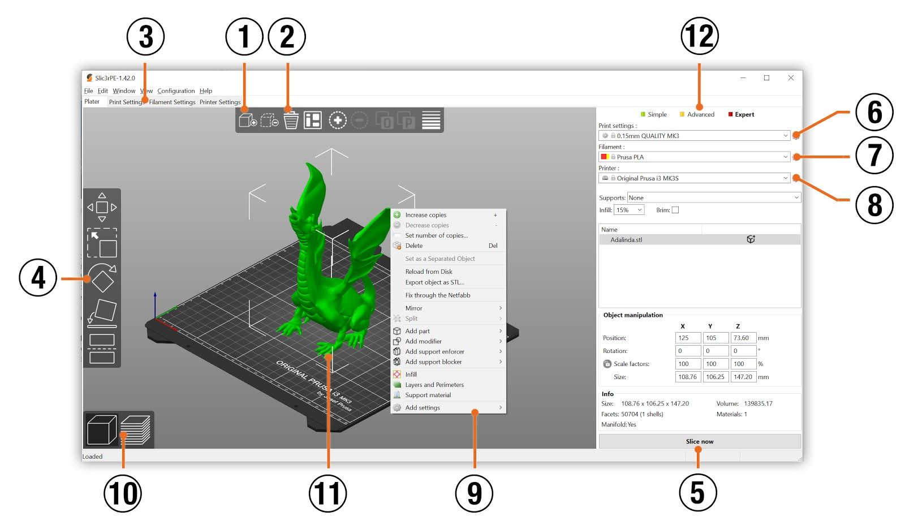
    *Source: MK3S Handbook, p. 50 — PrusaSlicer interface.*

    1. The **Add** button loads models into PrusaSlicer
    2. **Delete** and **Delete All** buttons remove model(s)
    3. Opens the detailed settings of **print, filament and printer**
    4. **Move, scale, rotate, Place on Face and Cut** tools
    5. **Slice and generate .gcode** button
    6. **Quality / Speed** setting of a print
    7. **Material** selection
    8. **Printer** selection
    9. Right-click on a model opens a context menu
    10. Switch between **3D editor** and **layers preview**
    11. Model preview
    12. Switch between **Simple / Advanced / Expert** mode

### 2.5.1 Initial setup and general workflow

Upon launching PrusaSlicer, select your printer from the **Printer drop-down menu** on the right
(No. 7 in the overview). If you don't see it in the list, add it either with **Add Printer → Add
Presets**, or by using **Configuration → Configuration Wizard** from the top menu bar.

Then select the **layer height**, **infill** and the **material** you intend to use. If you are
not sure about the layer height, stick with **0.15 mm** profiles as they give generally good
results.

Recommended infill values are between **5–20 %**, but it heavily depends on the model and how
durable it needs to be. More infill means a more durable model, however it will take longer to
print and more material will be consumed. For general use, there is no point in going above 40 %
infill unless your project really requires it.

!!! warning "Default profiles are tested"
    The default profiles have a tested, specific setting for each type of filament. If you choose
    a different profile, it may affect the print quality negatively.

PrusaSlicer allows you to import objects in **STL, OBJ, AMF, STEP and 3MF** formats — the most
common types of 3D files on the internet. You can either drag them directly into the 3D editor
window or use the **Add…** button from the top bar. To modify the model, use the tools on the
left sidebar: **Move, Scale and Rotate**. If an object is **blue**, it means it does not fit into
the print bed and needs to be moved or scaled down.

There is no universal way to place a model on the bed — it always depends on the specific shape.
However, a general rule is that the bigger the flat surface of the model that touches the bed,
the better it will hold — so position the **largest flat surface downwards**. You can use the
**Place on Face** function (key **F**) to do it quickly.

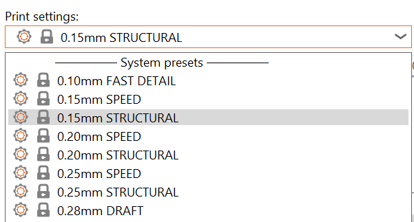
*Source: MK4S Handbook, p. 43 — importing a model into PrusaSlicer.*

### 2.5.2 Using supports

**Supports** are printed structures resembling scaffolding. They are used for printing complex
objects, and after printing they can be easily separated from the output.

A large number of objects can be printed without supports — just place them in the right
orientation on the bed, slice them and you can print. Not all objects, however, can be printed
without supports. If you are printing an object with walls that rise at an angle **less than 45°**,
these overhangs will cause issues with print quality. Also, keep in mind that the printer
**cannot start printing mid-air**. In such cases, supports are necessary.

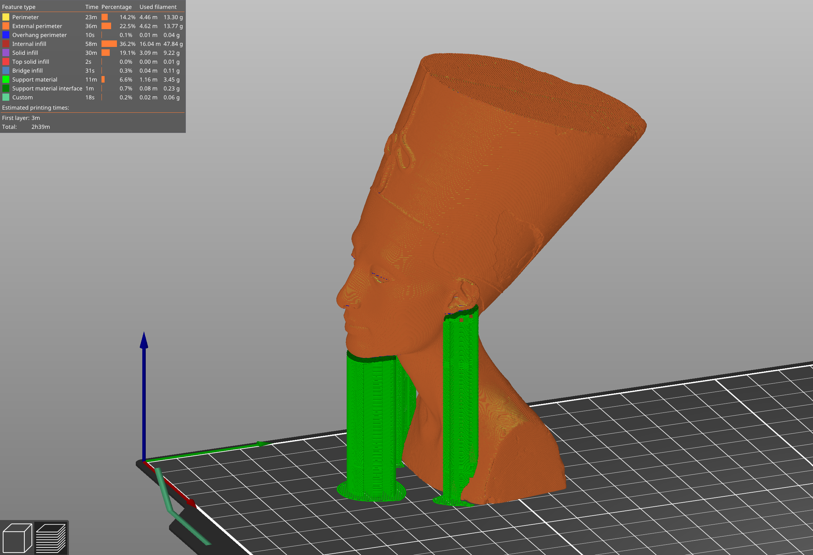
*Source: MK4S Handbook, p. 44 — support structures.*

**How to tell whether an object needs supports?** The shortest answer is: it comes with
experience. With your first prints, stick to the default PrusaSlicer values. Once you feel
comfortable printing complex shapes with default support settings, try playing with the
**Overhang threshold** option.

You have three options when selecting support generation:

| Option | Generates supports… |
|--------|---------------------|
| **Support on Build Plate Only** | only in the space between the object and the print bed |
| **For Support Enforcers Only** | only where enforced by placed modifiers |
| **Everywhere** | everywhere |

In the **Print Settings → Support Material** tab you can fine-tune support generation: check the
**Generate Support Material** box; the **Overhang Threshold** sets the minimum angle for printing
support material (zero enables automatic calculation); **Enforce Supports** is mainly used for
small models or models with a small base to prevent them being broken or detached from the bed.

!!! tip "Supports leave marks"
    Wherever the supports touch the model, they are usually associated with a lower surface
    quality. Try to reduce or even avoid the need for supports by rotating or shifting the model
    accordingly.

=== "MK3S — support menu"
    Choose the **Print Settings** tab and click **Support Material** in the left column. Check the
    **Generate support material** box, set the **Overhang threshold**, and use **Enforce support**
    for small models or models with a small base.

    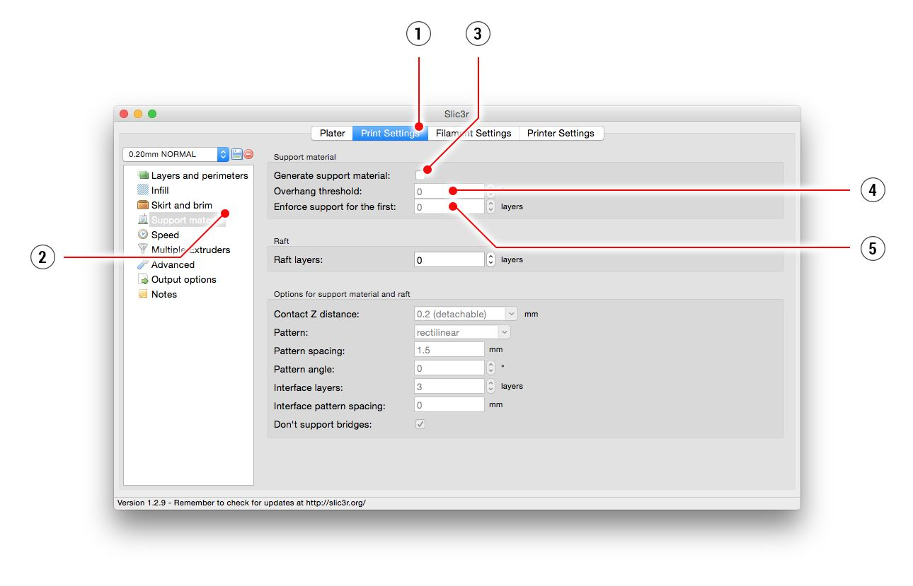
    *Source: MK3S Handbook, p. 51 — support material settings.*

### 2.5.3 Speed vs print quality

A small object can be printed in a few minutes but printing bigger models can take a lot of time
— sometimes even dozens of hours.

The printing speed is affected by several factors, primarily the **layer height**, set in the
**Print Settings** drop-down menu in the upper right corner. **0.15 mm STRUCTURAL** is pre-set,
but you can speed up printing by choosing e.g. **0.20 mm SPEED** — models printed like this will
have less detail and more visible layers. If you care more about quality than speed, choose
**0.10 mm (FAST DETAIL)** — the appearance of the models will improve, at the cost of a decreased
printing speed.

Some profiles may have two variants:

- **Structural** — slower perimeter and infill printing, improves the surface quality and
  structural integrity
- **Speed** — faster perimeter and infill printing, without too much impact on the surface
  quality; top speed while keeping good quality and accuracy

The speed can be adjusted during printing via **LCD Menu → Tune → Speed**. Observe the effect of
the speed change on the print quality. Remember that this setting does not affect the
acceleration of the printer, so the printing time will not be shortened proportionally to the
speed setting change.

### 2.5.4 Infill

Another parameter that affects the properties of the printed object is **Infill**. It affects the
printing speed, strength and appearance of the object. Objects printed with the FFF/FDM method
usually do not have 100 % density. Instead, they contain a certain geometric structure inside —
from simple square grids or hexagons to more complex patterns. The purpose of the infill is to
**stiffen the object from the inside**. Most models are printed with **10–15 % infill**, but if
you need a really solid structure, you can choose a higher density.

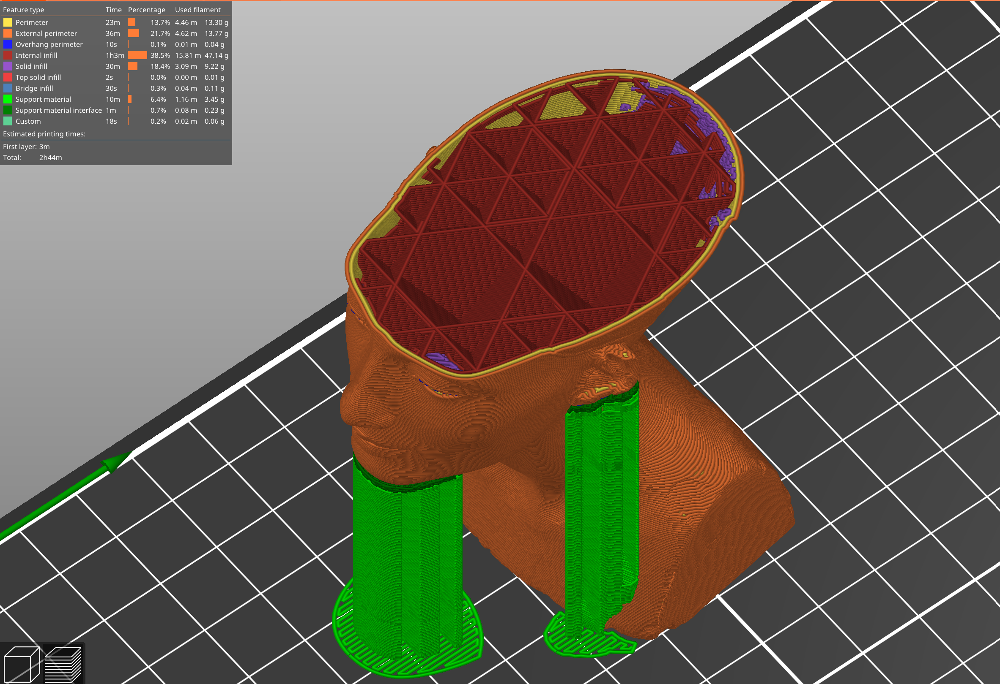
*Source: MK4S Handbook, p. 46 — infill density comparison.*

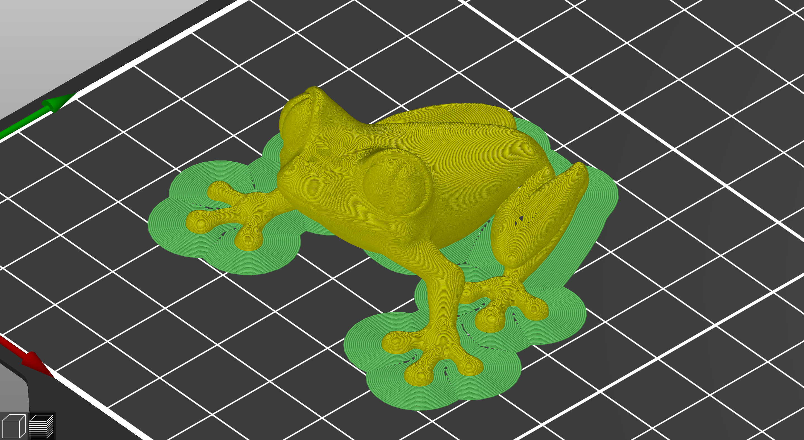
*Source: MK4S Handbook, p. 46 — infill patterns.*

### 2.5.5 Brim

The **brim** serves to increase adhesion to the bed, reducing the risk of warping. A wider first
layer is printed around the model. This makes sense especially if the model only touches the bed
in a small area. This function can be enabled in PrusaSlicer by checking the **"Brim"** box in
the right-hand menu. After printing is finished, the brim can usually be removed easily by hand,
or with a knife or scalpel.

### 2.5.6 Printing objects larger than the print volume

The MK4S / MK3.9S has a print volume of **250 × 210 × 220 mm** (the MK3S is 250 × 210 × 200 mm).
If this is not enough for your project, you can use PrusaSlicer's built-in tools to find a
solution.

**Resize** the imported model to fit the bed using the **Scale tool** (key **S**) — drag the
gizmo handles to scale uniformly or along one axis, or type an exact value.

**Cut** an object that is too large into several smaller parts using the **Cut tool** (key **C**).
Either place the cutting plane manually or set an exact height in the Cut tool dialog, and choose
whether to keep the part above the cut, below it, or both.

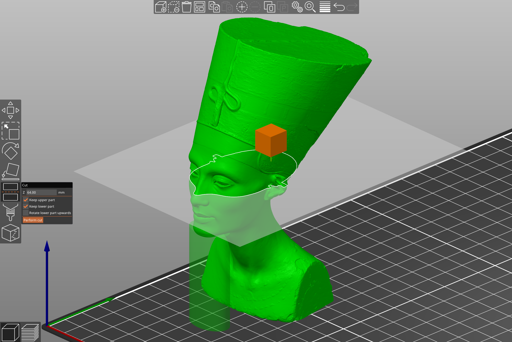
*Source: MK4S Handbook, p. 47 — resizing a model to fit the print bed.*

=== "MK3S — same tools, older interface"
    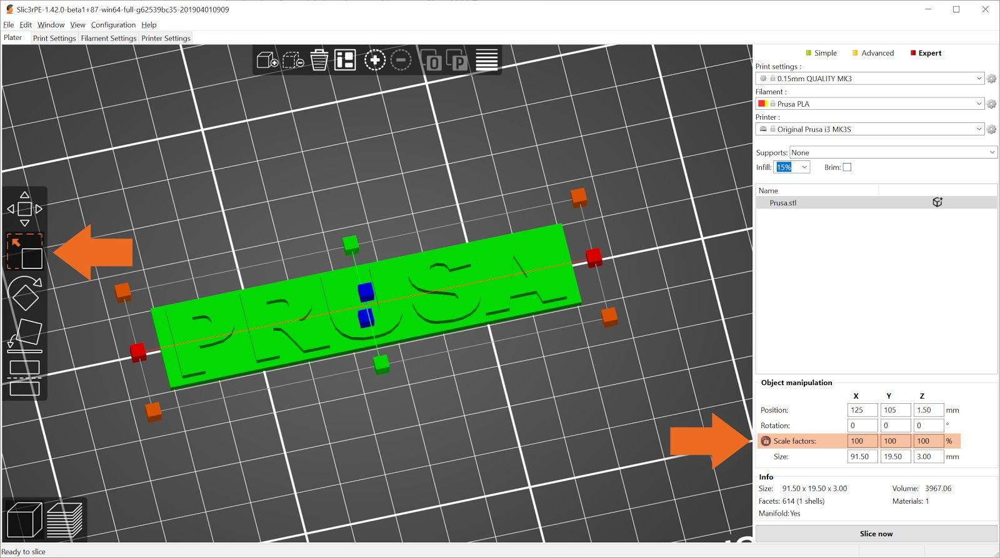
    *Source: MK3S Handbook, p. 52 — the Scale tool.*

    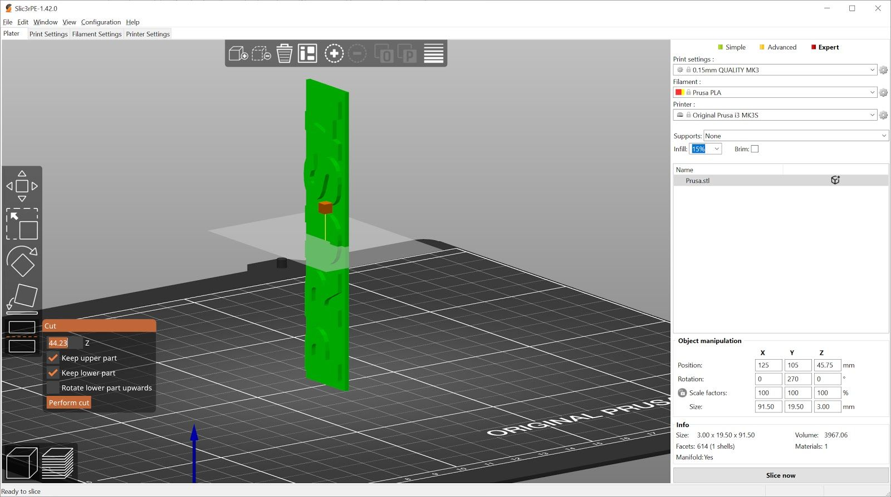
    *Source: MK3S Handbook, p. 52 — the Cut tool.*

!!! tip "Don't let the print bed limit you"
    At blog.prusa3d.com you can find tips on how to assemble large models from several smaller
    parts.

### 2.5.7 Printing multicolored objects (without MMU3)

If you want a print with layers in different colors, it can be set up directly in PrusaSlicer:

1. Switch to the **layer view (Preview)** using the button in the left bottom corner.
2. Use the slider on the right to select the layer where you want to change color.
3. Click on the **orange icon with the plus sign**.
4. An immediate preview will appear. Undo the color change by clicking the **grey cross** that
   appears instead of the orange plus sign.
5. Export the G-code and you can start printing!

Once the printer reaches the layer where the color change should happen, it will **pause and
display a prompt** on the screen. Follow the instructions on the screen to finish the filament
change.

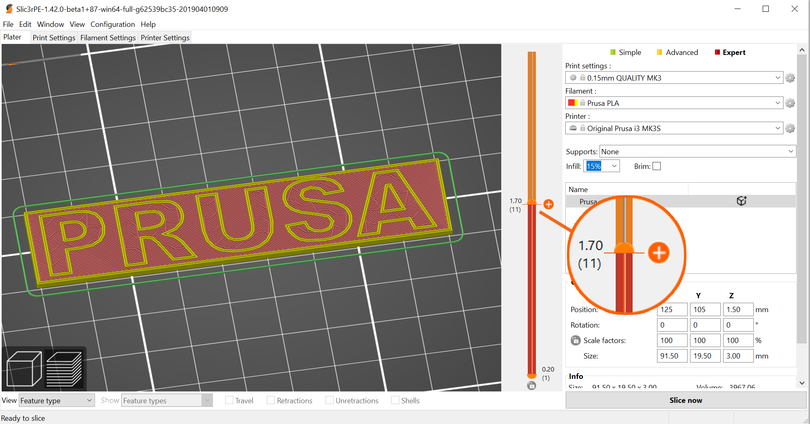
*Source: MK4S Handbook, p. 48 — color change in the Preview.*

=== "MK3S — ColorPrint"
    The MK3S handbook describes the same procedure (switch to layer preview, use the slider,
    click the orange plus icon), plus the older **ColorPrint web app**:
    prepare a regular G-code, go to blog.prusaprinters.org/color-print/, drag the G-code into the
    frame, click **Add change**, enter the layer height for the color change (found in the
    "Layers" tab of PrusaSlicer), then download the modified file.

    When a color change is triggered, the printer stops and retracts, raises Z by 2 mm and moves
    quickly outside the printbed, then prompts you to unload and reload the filament. You are then
    asked **"Changed correctly?"** with three options:
    - **Yes** — everything went ok; check the new color is clear
    - **Filament not loaded** — the printer starts the automatic filament load again
    - **Color not clear** — the printer extrudes more filament until the color is pure

    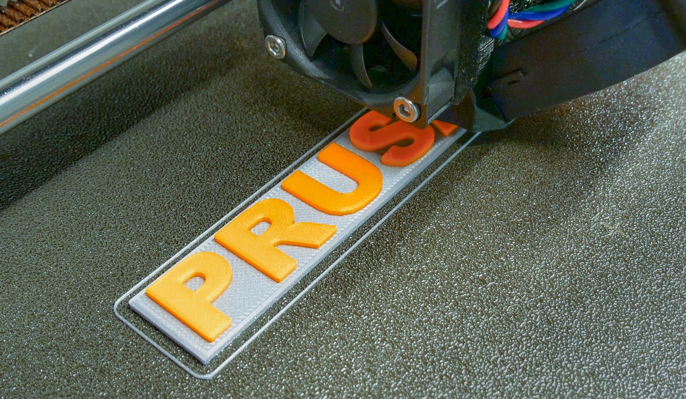
    *Source: MK3S Handbook, p. 53 — a multicolored object.*

    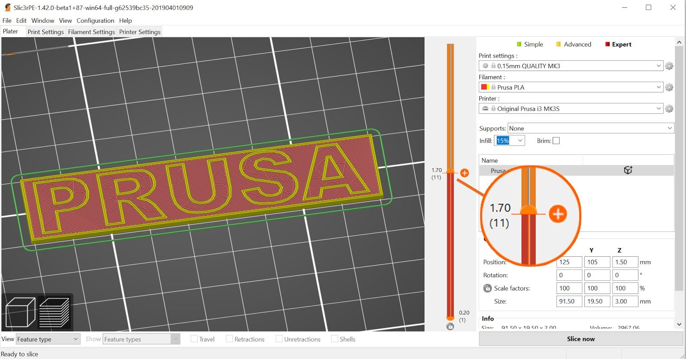
    *Source: MK3S Handbook, p. 53 — color change in PrusaSlicer.*

!!! warning "Use similar materials"
    Always use the same material, or combine materials with similar print temperatures and
    settings.

### 2.5.8 Slicing and exporting

One of the most important phases of the slicing process is the **final check of the sliced object
in the Preview**. Using the slider on the right, you can review all the print layers of the object
one by one. This helps you identify problematic spots — for example, if the bottom of the object
doesn't stick well to the bed, or if some parts are missing supports and are "hanging in the
air".

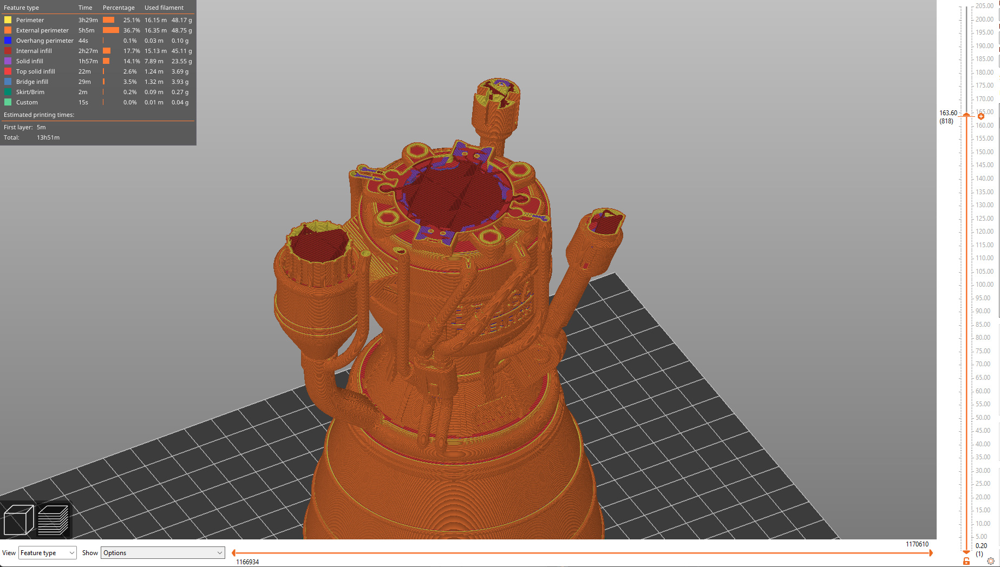
*Source: MK4S Handbook, p. 49 — inspecting the sliced object in the Preview.*

!!! danger "Always check the Preview first"
    Before you export the model as G-code and upload it to the USB drive, always check it in the
    Preview. It's the best way to avoid mistakes during printing.

---

## 2.6 Designing for 3D printing (MK3S handbook)

The MK3S handbook adds practical guidance for modeling that applies to any FDM printer. The most
important thing to keep in mind while modeling for 3D printing is **support material**: 3D
printers can't print in mid-air — each layer has to be laid on top of the previous layer. When
designing, avoid creating steep overhangs. That said, short horizontal bridges can be printed
without supports.

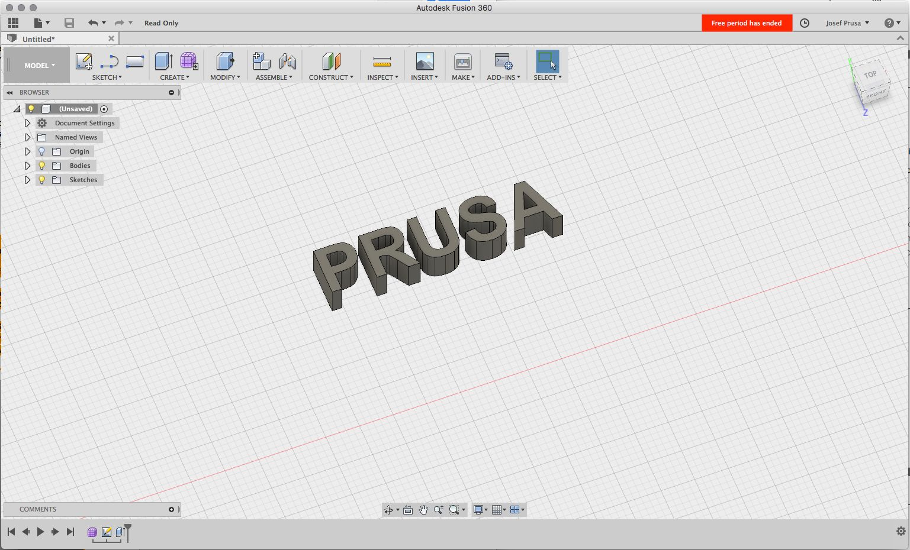
*Source: MK3S Handbook, p. 47 — overhangs and support material.*

### 2.6.1 Fillet vs chamfer

If oriented towards the print bed, **fillets create a very steep overhang**, which negatively
affects the surface of the object. For this reason, **use a chamfer instead** if perfect part
finish is the priority.

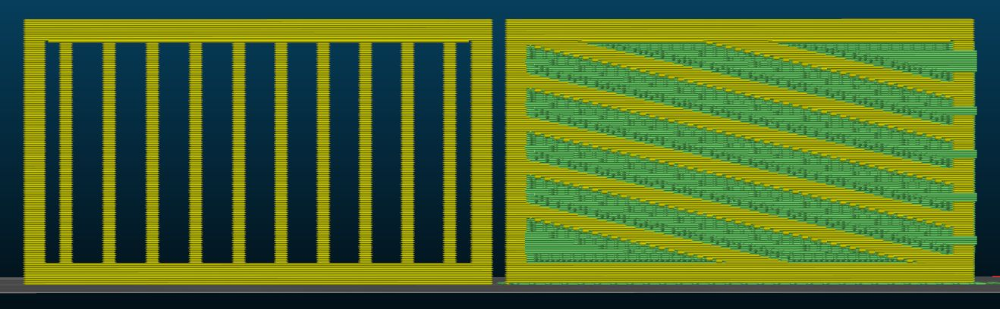
*Source: MK3S Handbook, p. 47 — fillet vs chamfer.*

### 2.6.2 Thin walls and minimum feature size

Another limitation is the **nozzle diameter**. The default nozzle size is **0.4 mm** with an
extrusion width of **0.45 mm**. Keep this number in mind, especially when designing thin walls or
tiny features. A wall thinner than one perimeter (0.45 mm) becomes unreliable; design walls in
multiples of the extrusion width for clean results.

### 2.6.3 Splitting a model into multiple parts

Both visuals and mechanical properties of a model can be improved by **splitting it into multiple
parts**. It's often better to split a complex object into parts that are easier to place on the
print platform, minimizing the number of supports required. You can then glue the object together.

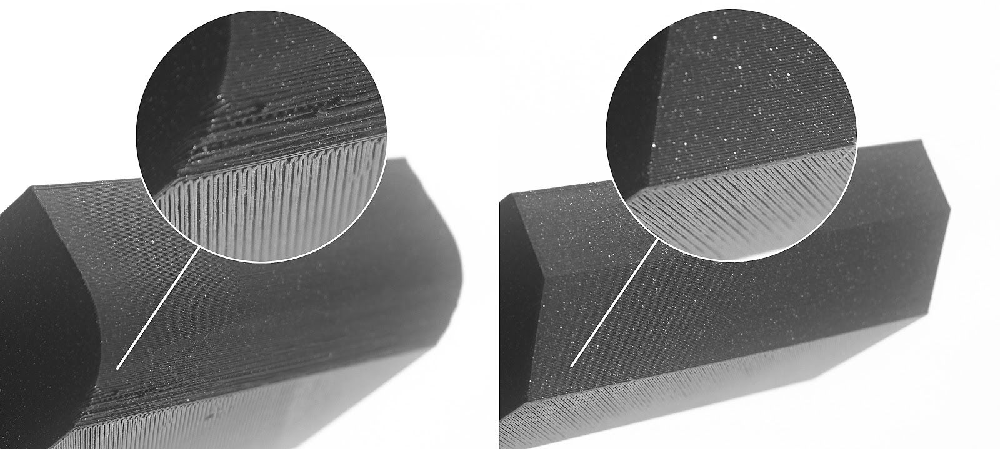
*Source: MK3S Handbook, p. 48 — splitting a model.*

### 2.6.4 Tolerances

When you design multiple parts that are supposed to fit into each other, you have to add a small
**tolerance (a gap)**. For example, if you want a cylinder to fit inside a circular hole, the
cylinder's diameter needs to be at least **0.1 mm smaller**. The good thing about 3D printing is
that you can quickly iterate and try which tolerance works best for your application:

| Tolerance | Fit |
|-----------|-----|
| 0.1 mm | Very tight |
| 0.15 mm | Tight |
| 0.20 mm | Loose |

---

## In your words — Module 2 reflection

- [ ] Explain the difference between an STL file and a G-code file.
- [ ] When would you use a brim, and when would you use supports?
- [ ] Download a model from Printables.com, slice it at 0.15 mm / 10 % infill, and describe what
      you see in the Preview.
- [ ] Why is it better to position the largest flat surface of a model downwards?
