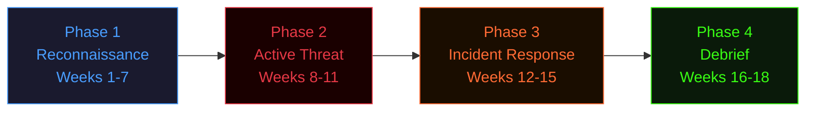

# REDBACK SYSTEMS // SOC Training Program

<div class="session-meta">
  <span>🔴 ACTIVE</span>
  <span>📋 CERT III CYBER SECURITY</span>
  <span>📍 NORTH METROPOLITAN TAFE</span>
</div>

---

```
██████╗ ███████╗██████╗ ██████╗  █████╗  ██████╗██╗  ██╗
██╔══██╗██╔════╝██╔══██╗██╔══██╗██╔══██╗██╔════╝██║ ██╔╝
██████╔╝█████╗  ██║  ██║██████╔╝███████║██║     █████╔╝ 
██╔══██╗██╔══╝  ██║  ██║██╔══██╗██╔══██║██║     ██╔═██╗ 
██║  ██║███████╗██████╔╝██████╔╝██║  ██║╚██████╗██║  ██╗
╚═╝  ╚═╝╚══════╝╚═════╝ ╚═════╝ ╚═╝  ╚═╝ ╚═════╝╚═╝  ╚═╝
███████╗██╗   ██╗███████╗████████╗███████╗███╗   ███╗███████╗
██╔════╝╚██╗ ██╔╝██╔════╝╚══██╔══╝██╔════╝████╗ ████║██╔════╝
███████╗ ╚████╔╝ ███████╗   ██║   █████╗  ██╔████╔██║███████╗
╚════██║  ╚██╔╝  ╚════██║   ██║   ██╔══╝  ██║╚██╔╝██║╚════██║
███████║   ██║   ███████║   ██║   ███████╗██║ ╚═╝ ██║███████║
```

---

## Welcome to the SOC

You have been assigned to the **Redback Systems Security Operations Centre** as a junior analyst. 

Redback Systems is a mid-sized Australian tech company that has been experiencing a wave of security incidents. Someone has been probing the network. A staff member clicked a phishing link. A laptop came back from a conference behaving strangely.

**Your job is to figure out what happened — and fix it.**

Over the next 18 weeks you will build the skills to do exactly that. You will learn by doing: running real attacks in isolated lab environments, writing real incident reports, and advising real (pretend) clients in plain language.

!!! danger "THIS IS NOT A TEXTBOOK COURSE"
    You will break things. You will get things wrong. You will have to document your failures
    as well as your successes — because that's what a real SOC analyst does.

---

## Your Units

This course covers three units of competency delivered together as a cluster:

| Code | Unit | When |
|------|------|------|
| ICTICT213 | Operate application software packages | Weeks 1–8 |
| ICTSAS214 | Protect devices from malware | Weeks 9–10 |
| ICTSAS305 | Provide ICT advice to clients | Weeks 11–18 |

---

## The Mission Arc



---

## Assessments

| Assessment | Description | Due |
|---|---|---|
| AT1 — Practical Portfolio | Tasks completed throughout the course | Week 18 |
| AT2 — ICTICT213 Knowledge Test | Short answer knowledge questions | Week 10 |
| AT3 — ICTSAS214 Knowledge Test | Short answer knowledge questions | Week 15 |
| AT4 — ICTSAS305 Knowledge Test | Short answer knowledge questions | Week 18 |

See [Assessment Overview](assessments/overview.md) for full details.

---

!!! note "ABOUT THIS SITE"
    This site is your course guide, lab manual, and reference resource.
    All lab instructions, assessment tasks, and resources live here.
    Bookmark it. Check it before every session.
