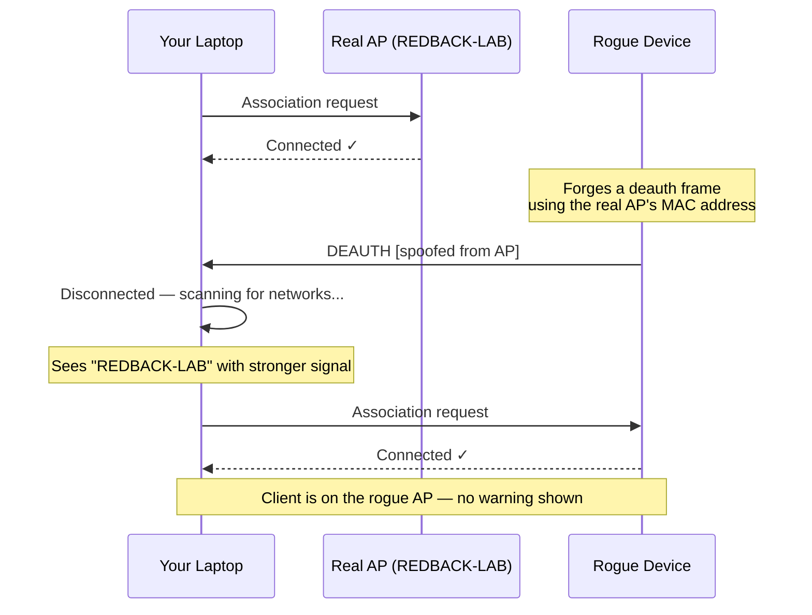

# WEEK 8 — Rogue IoT Device: WiFi Threat Analysis

<div class="session-meta">
  <span>📅 Week 8</span>
  <span>⏱ 2 Hours</span>
  <span>🔴 Phase 2 — Active Threat</span>
  <span>📋 ICTSAS214 · ICTSAS305</span>
</div>

---

!!! danger "MISSION BRIEF"
    **Incident Reference:** RBS-2025-008  
    **Classification:** TRAINING — CONTROLLED LAB ENVIRONMENT ONLY  
    
    A suspicious device was found plugged into a USB power point near the Redback Systems
    reception desk. It appears to be a small circuit board — possibly disguised as a phone
    charger. The IT team has recovered it and isolated it to the lab network.

    Your task: **find out what this device does, assess the risk to Redback Systems, and
    advise IT management.**

[📊 View Slides](/mkdocs-cyber/slides/week-08/){.md-button .md-button--primary}

---

## Learning Objectives

By the end of this session you will be able to:

- [ ] Explain what destructive firmware on an IoT device can do to a network
- [ ] Describe how a deauthentication attack works and why WPA2 allows it
- [ ] Observe a live demonstration of deauth and rogue AP attacks on the lab network
- [ ] Analyse PCAP evidence to identify deauthentication frames and rogue AP beacons
- [ ] Write an advisory memo to Redback Systems IT management

---

## Part 1 — What Is This Device? (25 min)

### The Device

The recovered item is an **ESP8266 microcontroller** — a cheap, widely available WiFi-capable chip used in IoT products like smart plugs, sensors, and home automation devices. This one is running **deauther firmware**: open-source software that turns the chip into a WiFi attack tool.

This is destructive software running on a compromised device. It is not a theoretical threat — ESP8266 boards cost under $10 AUD and deauther firmware is freely available online.

!!! warning "Real World"
    Similar attacks have been documented in hotel networks targeted by the APT28 threat
    group (Operation: Fancy Bear), and have appeared in ACSC advisories on WiFi-based
    attacks against Australian businesses. A device like this could be left in a waiting
    room, plugged into any standard USB charger port, and go unnoticed indefinitely.

---

### How the Firmware Works

The deauther firmware exploits a fundamental weakness in the WPA2 WiFi standard.

**The problem:** WiFi management frames — the packets that handle connecting, disconnecting, and roaming between access points — are **not authenticated** in WPA2. This was a design decision from the 1990s that was never fully corrected.



The client has no way to verify the disconnect came from the real access point. It just obeys.

**WPA3 fixes this** using Protected Management Frames (PMF / 802.11w), which cryptographically authenticate management frames. Most consumer and workplace hardware still runs WPA2.

---

### Discussion — Before We Watch the Demo

Take 5 minutes to discuss with the person next to you:

1. How would you know if your laptop was deauthenticated and reconnected to a rogue AP?
2. If an attacker controlled the WiFi network your laptop joined — what could they see?
3. What type of workplace would be most at risk from a device left near a public area?

---

## Part 2 — Live Demonstration (30 min)

!!! info "INSTRUCTOR-LED DEMO"
    Your lecturer will operate the recovered device and project the results. You do not
    need to run any tools. Your job is to **observe, record, and think critically** about
    what you see. Your observations are part of your AT1 evidence.

### What you will see

The device connects to a web interface at `192.168.4.1`. Your lecturer will step through three actions:

**1 — Scan**  
The device scans for nearby WiFi networks and lists every detected access point and connected client, including MAC addresses and signal strength.

**2 — Deauth Attack**  
The device sends forged disconnect frames to every client on `REDBACK-LAB`. Watch what happens to your own machine's WiFi connection.

**3 — Rogue AP (Evil Twin)**  
The device broadcasts a second `REDBACK-LAB` network. Watch your device's network list.

---

### Your Observation Tasks

While watching the demo, record the following. You will use this as AT1 evidence.

!!! note "AT1 OBSERVATION RECORD — complete during demo"

    **During the deauth attack:**

    - [ ] Did your device disconnect? Describe what you saw (any warning message? automatic reconnect?)
    - [ ] How long did the disconnection last?
    - [ ] Did your operating system notify you that anything unusual happened?

    **During the rogue AP:**

    - [ ] Screenshot your device's WiFi network list showing both `REDBACK-LAB` entries
    - [ ] Can you tell which one is the real access point and which is the rogue? How?
    - [ ] Write one sentence: what would happen if your device automatically connected to the wrong one?

---

### Discussion — After the Demo

1. Your device reconnected automatically with no warning. What does that mean for corporate devices used off-site?
2. The rogue AP had no password — would a real attacker use one? What would happen either way?
3. HTTPS encrypts traffic between your browser and a website — does that protect you here? (Think carefully.)

---

## Part 3 — PCAP Analysis: Reading the Evidence (30 min)

Your lecturer has provided a packet capture (`redback-deauth-sample.pcap`) taken during a deauth and rogue AP demonstration on the lab network. Open it in Wireshark on your Parrot OS machine.

!!! example "INSTRUCTOR PREP NOTE"
    Place the capture file at a location accessible to students before class — shared drive,
    USB, or pre-loaded onto student machines. To capture your own during lab prep: run
    Wireshark in monitor mode on a WiFi interface while operating the device, then save as
    `.pcap`. Any capture showing deauth frames (type 0x0c) and beacon frames (type 0x08)
    from two SSIDs with the same name will work.

---

### Step 1 — Open the capture

Launch Wireshark on Parrot OS and open the provided file:

```
File → Open → redback-deauth-sample.pcap
```

You'll see a list of 802.11 wireless frames. Most will be normal traffic — beacons, probe requests, data. You're looking for two specific frame types.

---

### Step 2 — Find the deauthentication frames

In the Wireshark filter bar, enter:

```
wlan.fc.type_subtype == 0x0c
```

This shows only deauthentication frames — the forged disconnect messages sent by the device.

Click on one. In the packet detail panel, expand **IEEE 802.11 Deauthentication**. Look for:

| Field | What to find | What it means |
|---|---|---|
| Source address | The AP's MAC (spoofed) | The device forged this — it's not the real AP sending this |
| Destination address | `ff:ff:ff:ff:ff:ff` (broadcast) | Sent to *all* clients at once |
| Reason code | Usually `7` | "Class 3 frame received from nonassociated station" — a generic disconnect reason |

!!! note "The key question"
    Where is the cryptographic signature on this frame? There isn't one. Any device in
    range can forge a deauth frame with any source address. The client cannot verify it.

**Screenshot the deauth frame with the detail panel open. Save this for your AT1 portfolio.**

---

### Step 3 — Find the rogue AP beacon

Clear the filter and enter:

```
wlan.fc.type_subtype == 0x08
```

This shows beacon frames — the regular broadcasts that announce an access point's presence.

Look for two beacon sources broadcasting the same SSID (`REDBACK-LAB`). They will have different MAC addresses (BSSIDs).

| Field | Legitimate AP | Rogue AP |
|---|---|---|
| BSSID | Original MAC | Different MAC |
| SSID | REDBACK-LAB | REDBACK-LAB |
| Signal | Lower (further away) | Higher (device is close) |

**Screenshot the beacon list showing two entries for the same SSID. Save for AT1.**

---

### Step 4 — Reflect

In your own words (one paragraph, written in your notes):

> *"The PCAP shows \_\_\_\_ deauthentication frames sent from MAC address \_\_\_\_, spoofed to appear as if they came from the legitimate access point. A second access point with the same SSID is visible in the beacon frames, broadcasting from MAC \_\_\_\_. A client automatically reconnecting after the deauth attack could join the rogue AP without any visible warning."*

Fill in the blanks. This paragraph becomes part of your advisory memo.

---

## Part 4 — Advisory Memo to IT Management (25 min)

You have observed the device operating and analysed the packet-level evidence. Now write the advisory.

!!! note "AT1 PRACTICAL TASK — Advisory Memo"
    **Task:** 8.1  
    **Units:** ICTSAS214 elements 2.3, 3.1, 3.3 · ICTSAS305 elements 1.3, 1.4, 2.2, 2.3, 2.8, 2.9

    Write a brief advisory memo addressed to the Redback Systems IT Manager. Your reader
    is technically aware but not a security specialist. No jargon without explanation.

    Your memo must cover:

    - [ ] **What the device is** — what type of device was found, what firmware it runs, what it is capable of
    - [ ] **What it did** — what the deauth attack does to client devices, and how the rogue AP works
    - [ ] **What an attacker could capture** — credentials submitted via HTTP, session cookies, DNS queries, unencrypted emails; note that HTTPS protects content but not the fact that a connection was made
    - [ ] **Risk to Redback Systems** — who in the office connects to WiFi? What data might be at risk?
    - [ ] **Recommended actions** — immediate steps (change passwords for accounts used on WiFi that day) and longer-term defences (see below)

    Use the [Redback Systems Incident Report Template](../resources/intranet.md#incident-report-template).

---

## Debrief — How Do We Defend Against This?

=== "For Users"
    - Use a VPN on any WiFi network you don't control — this encrypts traffic even if you've joined a rogue AP
    - If your WiFi drops unexpectedly and reconnects — be suspicious, especially on public or shared networks
    - Check the network name carefully before connecting — two identical names in the list is a warning sign
    - WPA3 networks with PMF enabled block deauth attacks at the protocol level

=== "For Organisations"
    - **Deploy 802.11w (Protected Management Frames)** on all access points — this is the technical fix
    - Issue and mandate VPN clients for all staff — the last line of defence when protocol controls fail
    - Conduct physical security checks — reception areas, meeting rooms, and common spaces are risk zones for planted devices
    - Train staff to report unexpected WiFi drops or unfamiliar network names

=== "For the Network"
    - Use a **Wireless Intrusion Detection System (WIDS)** — enterprise APs (Cisco, Aruba, Meraki) have built-in duplicate SSID detection
    - Segment guest WiFi from the corporate network entirely — a rogue AP on guest WiFi can't reach internal systems
    - Use **802.1X certificate-based authentication** so devices verify the AP's identity before connecting

---

## Unit Mapping

??? info "Assessment Evidence — Click to expand"

    | What you did | Unit | Element/PC |
    |---|---|---|
    | Researched destructive IoT firmware and identified the threat type | ICTSAS214 | 1.1, 1.2 |
    | Observed demo and recorded network impact | ICTSAS214 | 2.2 |
    | Analysed PCAP to identify deauth frames and rogue AP beacons | ICTSAS214 | 2.2, 2.3 |
    | Documented findings and outcomes | ICTSAS214 | 3.1, 3.2, 3.3 |
    | Investigated and documented the support issue | ICTSAS305 | 1.3 |
    | Notified IT Manager of findings and provided advice | ICTSAS305 | 1.4, 2.2, 2.3 |
    | Communicated technical findings in plain language | ICTSAS305 | 2.8, 2.9 |

---

## Resources

- [ESP8266 Deauther — SpacehuhnTech](https://github.com/SpacehuhnTech/esp8266_deauther)
- [ACSC — Protecting Against WiFi Threats](https://www.cyber.gov.au)
- [802.11w — Protected Management Frames explained](https://en.wikipedia.org/wiki/IEEE_802.11w-2009)
- [Wireshark 802.11 Display Filters](https://www.wireshark.org/docs/dfref/w/wlan.html)
- [Wireshark — Session 9 preview](../sessions/session-09.md)

---

!!! warning "LEGAL & ETHICAL REMINDER"
    The device demonstrated today was operated on an **isolated lab network** with explicit
    permission. Operating a deauther or rogue access point on any other network — including
    TAFE WiFi — is illegal under the **Criminal Code Act 1995 (Cth)** and the
    **Cybercrime Act 2001**.

    Understanding this attack makes you more capable of defending against it.
    Deploying it without authorisation makes you a criminal. Your choice.
