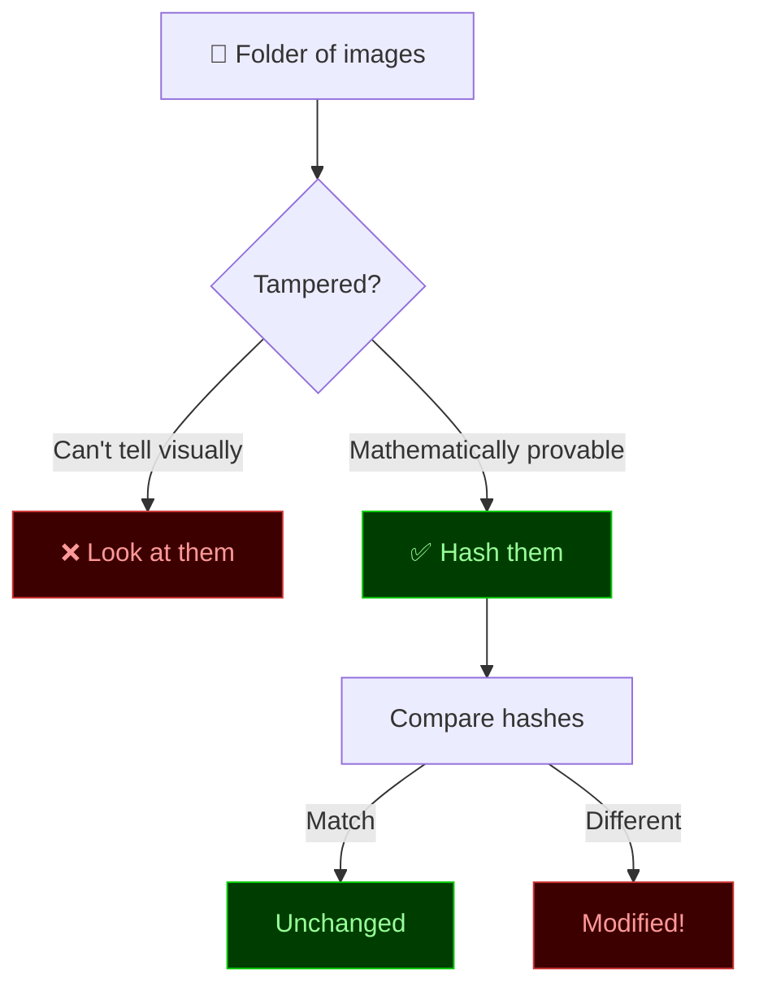
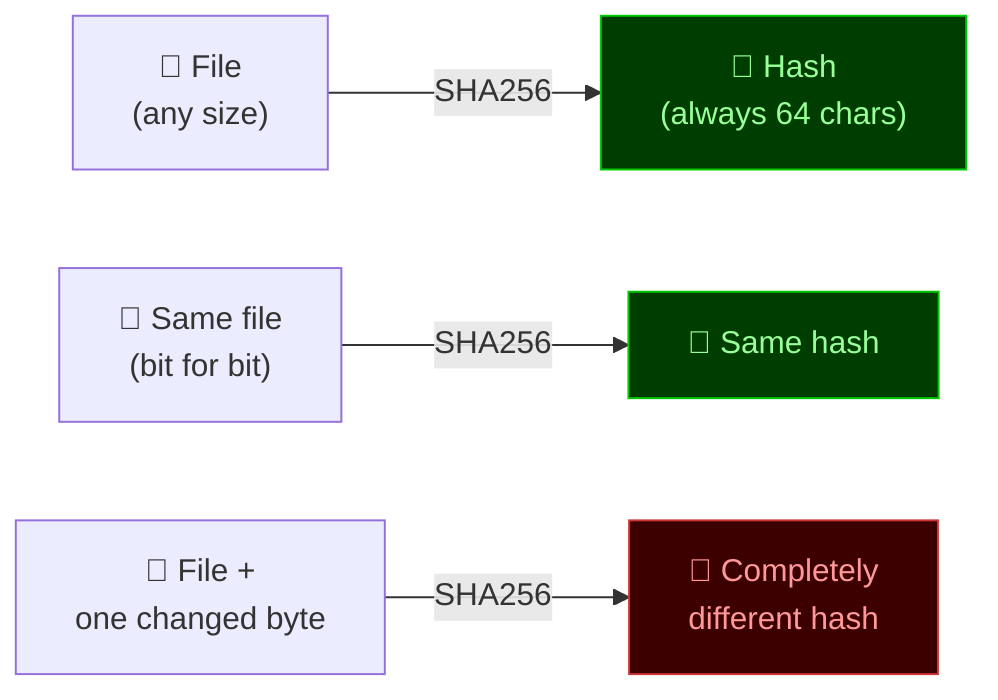
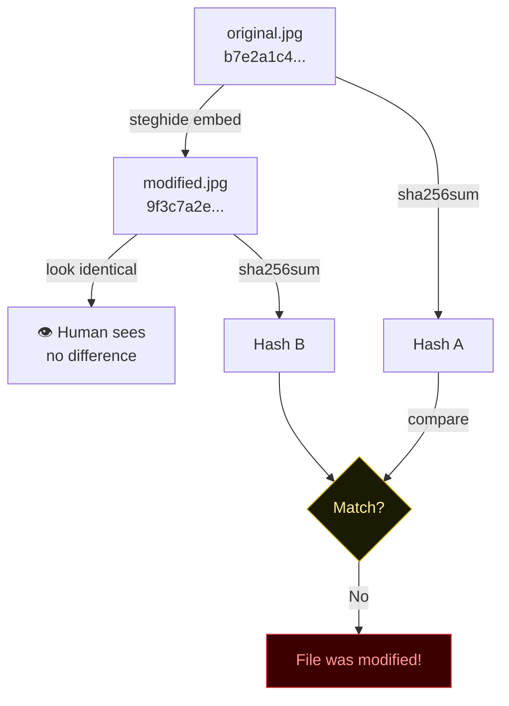
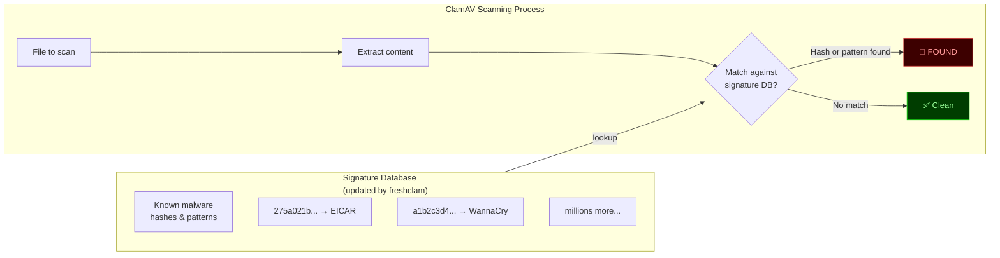
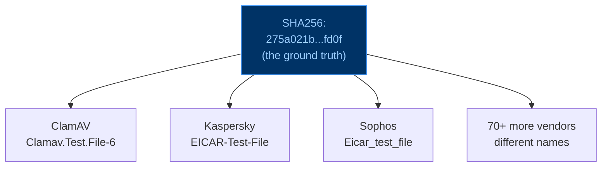
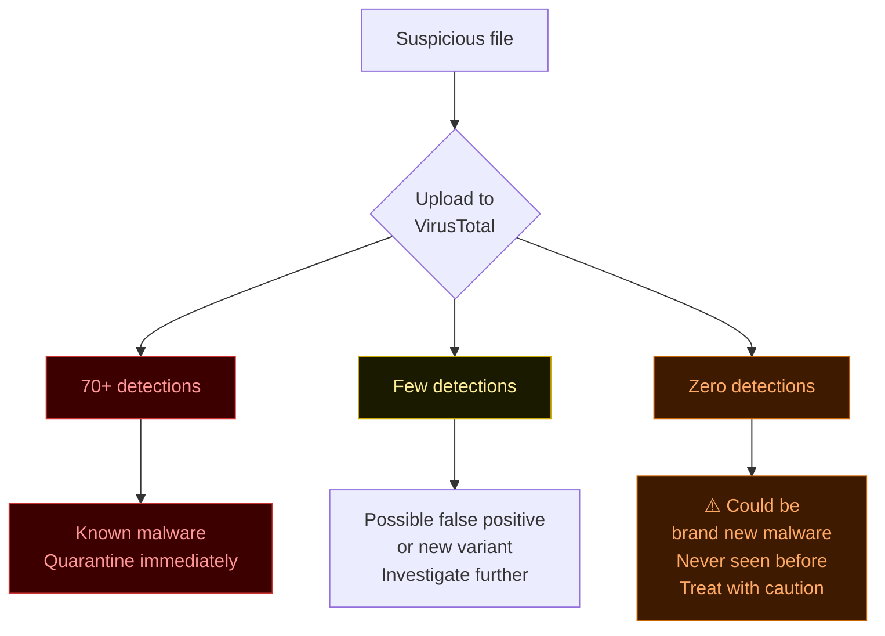
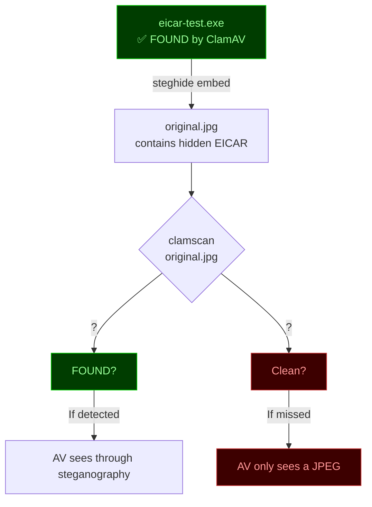
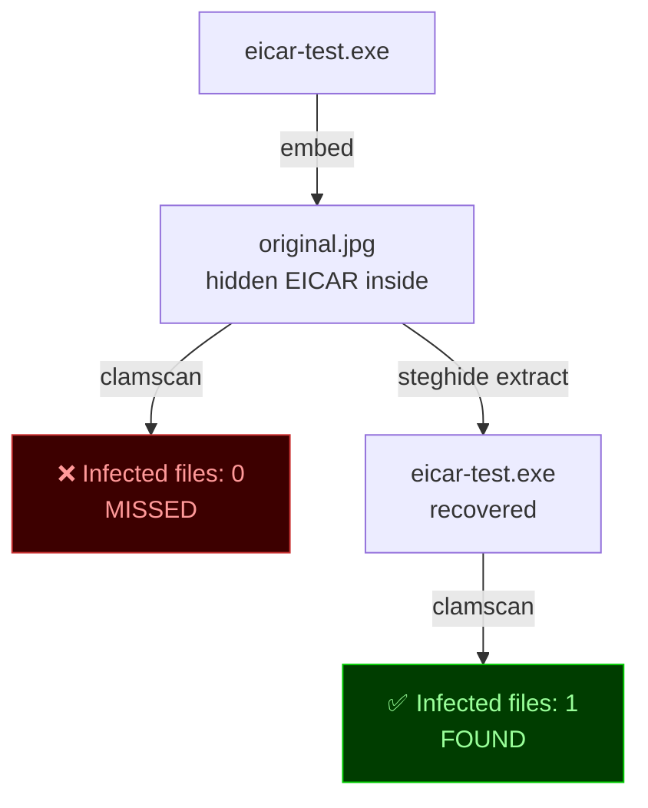
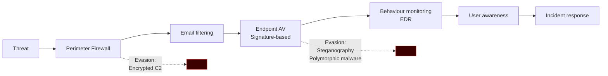

# Week 7
## Hashing & Malware Scanning

<div class="text-sm text-gray-400 mt-4">ICTSAS214 · Redback Systems SOC · Lab Session</div>

---
layout: default
---

# Mission Brief

<div class="grid grid-cols-2 gap-8 mt-6">
<div>

**Incident Reference:** RBS-2025-007

Last week you hid data inside image files using steganography.

Today someone hands you a folder of images and asks:

> *"Have any of these been tampered with?"*

You can't tell by looking. You need to prove it mathematically.

Then you need to scan the machine — and find out whether your antivirus can catch something you've already hidden inside it.

</div>
<div>



</div>
</div>

---
layout: default
---

# Today's Plan

<div class="grid grid-cols-3 gap-4 mt-6 text-sm">

<div class="border border-green-800 rounded p-4 bg-green-950">

### 🔌 Setup (~10 min)
**Dongles IN**

- Install ClamAV + test files
- Run `freshclam`
- Definitions updated

**Dongles OUT**

Air-gapped from here

</div>

<div class="border border-blue-800 rounded p-4 bg-blue-950">

### 🔐 Theory + Hands-on

- What is hashing?
- `sha256sum` on last week's images
- Prove stego modified the file
- ClamAV baseline scan
- EICAR detection
- VirusTotal — name vs hash

</div>

<div class="border border-orange-800 rounded p-4 bg-orange-950">

### 🧪 The Experiment

- Hide EICAR inside an image
- Does ClamAV catch it?
- Extract it — scan again
- Discussion: what does this mean?
- Written task → AT1 portfolio

</div>
</div>

---
layout: default
---

# What is a Hash?

A hash function takes any file as input and produces a fixed-length fingerprint.

<div class="grid grid-cols-2 gap-8 mt-4">
<div>



</div>
<div class="text-sm mt-2">

**Three rules:**

1. **Deterministic** — same input always produces same output
2. **One-way** — you cannot reverse a hash back to the file
3. **Avalanche effect** — one changed byte → completely different hash

**Common hash functions:**

| Function | Output length | Use |
|----------|--------------|-----|
| MD5 | 128 bit / 32 chars | Integrity checks (not security) |
| SHA256 | 256 bit / 64 chars | Standard — use this |
| SHA512 | 512 bit / 128 chars | High security contexts |

</div>
</div>

---
layout: default
---

# Hashing in Practice

```bash
# Hash a single file
sha256sum photo.jpg
# a3f4c8d2e1b97f3a...c4d8  photo.jpg

# Hash multiple files
sha256sum *.jpg

# Save to a baseline record
sha256sum *.jpg > baseline.txt

# Later — verify nothing changed
sha256sum --check baseline.txt
# photo.jpg: OK
# modified.jpg: FAILED
```

<div class="grid grid-cols-2 gap-6 mt-4 text-sm">
<div class="border border-gray-700 rounded p-4">

### Where this is used

- **Digital forensics** — hash evidence on collection, prove chain of custody
- **Software distribution** — hash published alongside download, verify before install
- **File integrity monitoring** — alert when system files change unexpectedly
- **Password storage** — passwords stored as hashes, never plaintext

</div>
<div class="border border-gray-700 rounded p-4">

### Key point

If two files have the same hash — they are **identical**, byte for byte.

If hashes differ — the files are **different**. Doesn't matter if they look the same. The hash doesn't lie.

This is your answer to "has this file been tampered with?"

</div>
</div>

---
layout: default
---

# Back to Last Week

You embedded a secret file inside a JPEG using steghide. The image *looks* identical. But:

<div class="grid grid-cols-2 gap-8 mt-6">
<div>

```bash
sha256sum original.jpg
# b7e2a1c4f8d3...  original.jpg

sha256sum modified.jpg
# 9f3c7a2e1b4d...  modified.jpg
#  ↑ completely different
```

<div class="mt-4 text-sm border border-orange-800 bg-orange-950 rounded p-4">

**Why are they different?**

Steghide modifies the least significant bits of the image's pixel data to store the hidden content. The visual difference is imperceptible to the human eye — but every byte steghide touched changes the hash.

</div>

</div>
<div>



</div>
</div>

---
layout: default
---

# How Antivirus Works

Before we scan anything — what is ClamAV actually doing?

<div class="mt-4">



</div>

<div class="text-sm mt-4 border border-gray-700 rounded p-3">

This is called **signature-based detection**. The AV knows what bad things look like and checks every file against that list. It can only catch threats it has seen before — which is why `freshclam` matters. Outdated definitions = blind to new threats.

</div>

---
layout: default
---

# EICAR — The Universal Test File

<div class="grid grid-cols-2 gap-8 mt-4">
<div>

EICAR is a 68-byte text string agreed upon by the entire AV industry as a harmless test file.

Every AV product on earth is trained to detect it.

```
X5O!P%@AP[4\PZX54(P^)7CC)7}
$EICAR-STANDARD-ANTIVIRUS-TEST-FILE!$H+H*
```

It came with your `clamav-testfiles` install at:
```
/usr/share/clamav-testfiles/
```

```bash
clamscan /usr/share/clamav-testfiles/clam.exe

# Output:
# clam.exe: Clamav.Test.File-6 FOUND
# Infected files: 1
```

</div>
<div>

### Why does this exist?

<div class="text-sm space-y-2 mt-2">

Before EICAR, IT teams tested AV by using **real malware**. This was dangerous and often illegal.

EICAR gives everyone a safe, standardised way to:

- Verify AV is installed and running
- Verify definitions are current
- Test that detection and quarantine work
- Train staff on what an AV alert looks like

It has never been changed since 1996. The entire security industry agreed to keep detecting it forever.

</div>

<div class="mt-4 border border-green-800 bg-green-950 rounded p-3 text-sm">

✅ **Completely harmless** — it's just text, it cannot execute, it cannot spread

</div>

</div>
</div>

---
layout: default
---

# Name vs Hash — VirusTotal

ClamAV called it `Clamav.Test.File-6`. But look at what other vendors call the same file:

<div class="grid grid-cols-2 gap-6 mt-4">
<div>

| Vendor | Detection name |
|--------|---------------|
| ClamAV | `Clamav.Test.File-6` |
| Kaspersky | `EICAR-Test-File` |
| Sophos | `Eicar_test_file` |
| Malwarebytes | `Trojan.Eicar` |
| Trend Micro | `EICAR_TEST` |
| Windows Defender | `Virus:DOS/EICAR_Test_File` |
| Norton | `EICAR Test String` |

**All different names. Same file.**

</div>
<div>



<div class="text-sm mt-4 border border-blue-800 bg-blue-950 rounded p-3">

**The hash is the identity. The name is just a label.**

Renaming `eicar.exe` → `invoice.pdf` doesn't change the hash — AV still detects it.

But change even one byte → new hash → AV misses it. This is how malware authors evade detection.

</div>

</div>
</div>

---
layout: default
---

# VirusTotal in the Real World

<div class="grid grid-cols-2 gap-6 mt-4">
<div class="text-sm">

**virustotal.com** — paste a hash or upload a file, see what 70+ AV engines think

Security analysts use it every day.

```
EICAR SHA256:
275a021bbfb6489e54d471899f7db9d1663fc695ec2fe2a2c4538aabf651fd0f
```

**Reading the results:**

- 70/72 detected → definitely malware
- 1/72 detected → possibly a false positive
- 0/72 detected → **most concerning**

</div>
<div>



</div>
</div>

<div class="text-sm mt-2 border border-orange-800 bg-orange-950 rounded p-3">

⚠️ **Be careful what you upload.** VirusTotal shares uploaded files with AV vendors. Never upload files containing sensitive company data or unreleased malware samples. Paste the hash instead — same result, no data shared.

</div>

---
layout: default
---

# The Experiment

You've seen ClamAV detect EICAR directly. Now let's hide it.

<div class="grid grid-cols-2 gap-8 mt-4">
<div>

```bash
# 1. Copy EICAR to work with
cp /usr/share/clamav-testfiles/clam.exe \
   /tmp/eicar-test.exe

# 2. Hide it inside a JPEG
steghide embed \
  -cf original.jpg \
  -sf /tmp/eicar-test.exe \
  -p "redback2025"

# 3. Scan the image
clamscan original.jpg
```

<div class="mt-4 text-sm border border-yellow-800 bg-yellow-950 rounded p-3">

**Before you run step 3 — write down your prediction.**

Do you think ClamAV will detect the EICAR file hidden inside the image?

</div>

</div>
<div>



</div>
</div>

---
layout: default
---

# The Result

<div class="grid grid-cols-2 gap-8 mt-4">
<div>

### Scan the image
```bash
clamscan original.jpg

# --------------------------------
# Infected files: 0   ← missed it
# --------------------------------
```

### Extract and scan
```bash
steghide extract \
  -sf original.jpg \
  -p "redback2025"

clamscan eicar-test.exe

# --------------------------------
# Infected files: 1   ← found it
# --------------------------------
```

</div>
<div>



**Same malicious content.**
**Two completely different results.**

</div>
</div>

---
layout: default
---

# Why Did ClamAV Miss It?

<div class="grid grid-cols-2 gap-8 mt-4">
<div>

ClamAV uses **signature-based detection**.

It looks for known byte patterns and hashes in the file it scans.

When steghide embeds the EICAR file inside the JPEG, it **fragments and distributes** the bytes across the image data using LSB (least significant bit) encoding.

The original EICAR byte pattern no longer exists as a contiguous sequence in the file.

ClamAV scans the JPEG and sees... a JPEG.

</div>
<div>

```mermaid
flowchart LR
    subgraph EICAR ["EICAR file - contiguous bytes"]
        direction LR
        A[X5O!P%]
        B[@AP...]
        C[EICAR...]
    end

    subgraph STEGO ["After steghide - bytes scattered"]
        direction LR
        D[JPEG header]
        E[pixel...x...pixel]
        F[pixel...5...pixel]
        G[pixel...O...pixel]
        H[pixel...!...pixel]
    end

    EICAR -->|embed| STEGO

    subgraph SCAN ["ClamAV scan"]
        I{Pattern match?}
        I -->|No contiguous\npattern found| J[Clean ✓]
    end

    STEGO --> SCAN

    style J fill:#3d0000,stroke:#cc3333,color:#ff9999
```

</div>
</div>

---
layout: default
---

# Defence in Depth

ClamAV missing the hidden EICAR is not a bug. It's a fundamental limitation of signature-based AV. **Every** AV product works this way.

<div class="mt-4">



</div>

<div class="grid grid-cols-3 gap-4 text-sm mt-4">
<div class="border border-gray-700 rounded p-3">

**Signature AV** catches known threats with known signatures. Fast, low overhead. Blind to new and modified malware.

</div>
<div class="border border-gray-700 rounded p-3">

**Behaviour/EDR** watches what files *do* — network calls, registry changes, process injection. Catches novel threats. Higher overhead.

</div>
<div class="border border-gray-700 rounded p-3">

**User awareness** catches what technology misses — social engineering, insider threat, physical access. The human layer.

</div>
</div>

---
layout: default
---

# Today's Task — AT1 Evidence

<div class="grid grid-cols-2 gap-6 mt-4 text-sm">
<div>

### Screenshots needed

- [ ] `freshclam` output — definitions updated
- [ ] Hashes of original vs stego-modified image — show they're different
- [ ] ClamAV clean scan — `Infected files: 0`
- [ ] ClamAV scan of EICAR — `FOUND` + signature name visible
- [ ] VirusTotal — multiple vendor names for same hash (lecturer screen ok)
- [ ] ClamAV scan of image with hidden EICAR — result (whatever it is)
- [ ] ClamAV scan of extracted EICAR — `FOUND`

</div>
<div>

### Written answers

**1.** What is a hash and why can't you tell by looking if a file was modified?

**2.** VirusTotal showed 70+ vendors, all different names for the same file. Why does the hash matter more than the name?

**3.** ClamAV detected EICAR directly but missed it hidden in the image. Why?

**4.** What does this tell you about relying on AV as your only security control?

</div>
</div>

<div class="mt-4 border border-green-800 bg-green-950 rounded p-3 text-sm text-center">

📁 Submit screenshots + written answers to your **AT1 portfolio folder**

</div>

---
layout: center
class: text-center
---

# Key Takeaways

<div class="grid grid-cols-2 gap-6 mt-8 text-left text-sm max-w-2xl mx-auto">

<div class="border border-gray-700 rounded p-4">

**🔑 Hashing**

A file's hash is its mathematical identity. You cannot fake a matching hash without an identical file. One byte changed = completely different hash.

</div>

<div class="border border-gray-700 rounded p-4">

**🦠 Signature AV**

Fast and effective against known threats. Blind to the same threat when fragmented or modified. Not a complete defence on its own.

</div>

<div class="border border-gray-700 rounded p-4">

**📛 Name vs Hash**

70 vendors, 70 names, one file. The hash is the ground truth. Renaming malware fools no one. Modifying it fools everyone with outdated signatures.

</div>

<div class="border border-gray-700 rounded p-4">

**🧅 Defence in Depth**

No single control catches everything. AV + EDR + email filtering + user training + monitoring = overlapping layers where each gap is covered by another layer.

</div>

</div>

<div class="mt-8 text-gray-400 text-sm">Week 7 complete · Next week: WiFi attacks</div>
