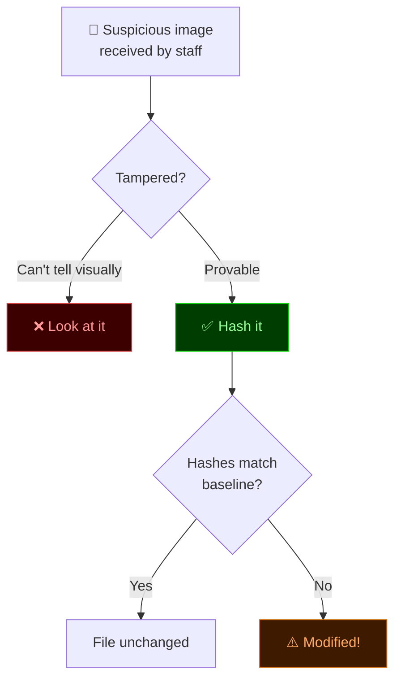
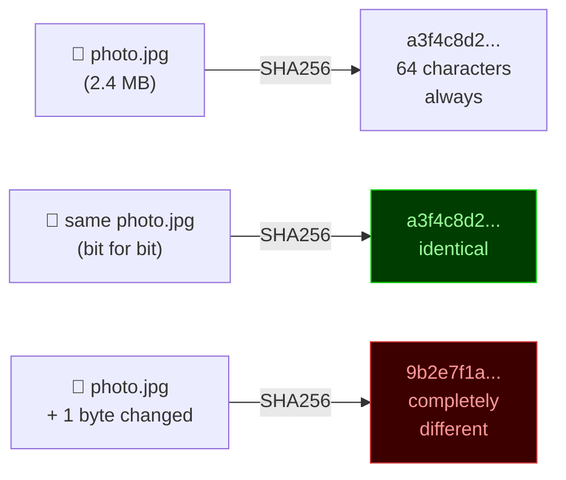
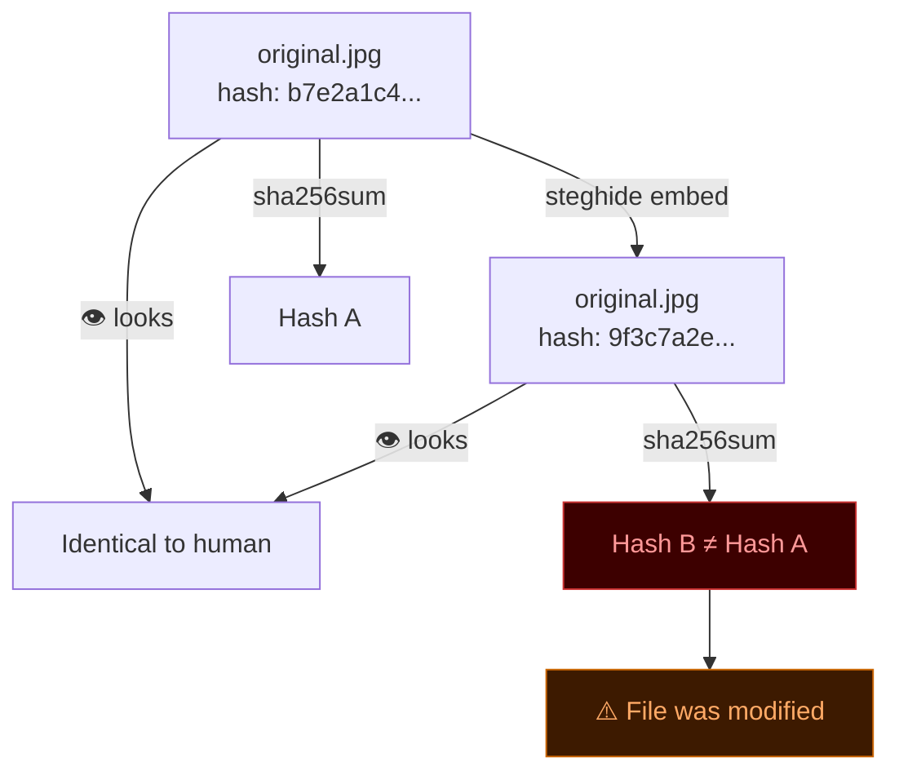
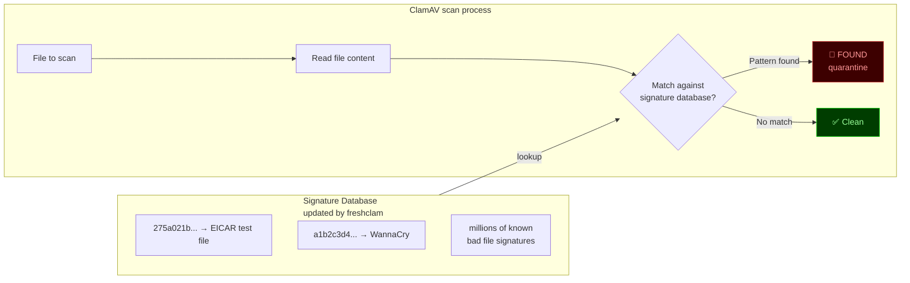
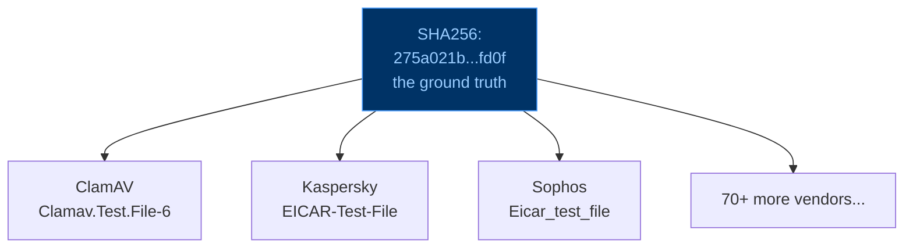
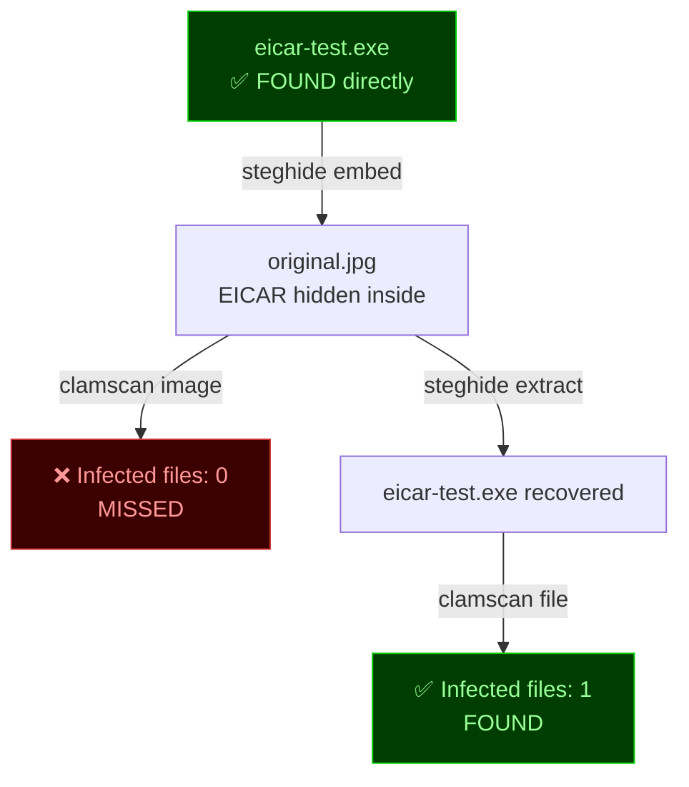
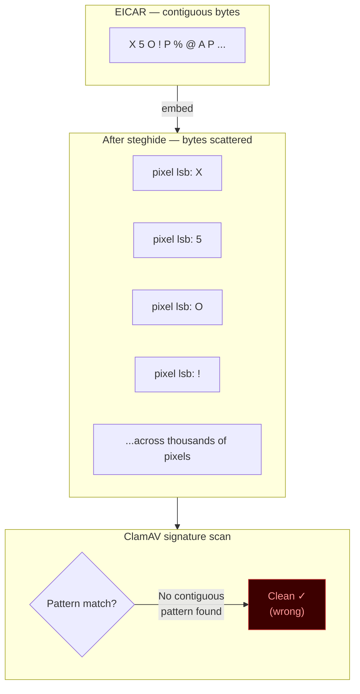
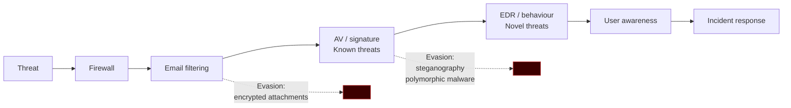

# Week 7
## Steganography, Hashing & Malware Scanning

<div class="text-sm text-gray-400 mt-4">ICTSAS214 · Redback Systems SOC · Lab Session</div>

---
layout: default
---

# Mission Brief

<div class="grid grid-cols-2 gap-8 mt-6">
<div class="text-sm">

**Incident Reference:** RBS-2025-007

A staff member received an image file via email from an unknown sender.

It looks like a normal photo.

Your job today:

- Prove mathematically whether the file was tampered with
- Scan the machine for malware
- Find out whether your AV would even catch something hidden inside it

</div>
<div>



</div>
</div>

---
layout: default
---

# Today's Plan

<div class="grid grid-cols-3 gap-4 mt-6 text-sm">
<div class="border border-green-800 rounded p-4 bg-green-950">

### 🔌 First (~10 min)
**Dongles IN**

Install ClamAV + test files

Run `freshclam`

**Dongles OUT**

Air-gapped from here

</div>
<div class="border border-blue-800 rounded p-4 bg-blue-950">

### 🔐 Theory + Hands-on

- What is hashing?
- Steganography changes the hash
- How AV signature detection works
- What is EICAR?

</div>
<div class="border border-orange-800 rounded p-4 bg-orange-950">

### 🧪 The Experiment

- Baseline scan
- Detect EICAR directly
- Hide EICAR in image
- Does AV catch it?
- VirusTotal — name vs hash

</div>
</div>

---
layout: default
---

# What is a Hash?

<div class="grid grid-cols-2 gap-8 mt-4">
<div>

A hash function takes any file and produces a fixed-length fingerprint.



</div>
<div class="text-sm mt-2">

**Three rules:**

1. Same input → always same output
2. One-way — cannot reverse a hash back to the file
3. One byte changed → completely different hash

**Common hash functions:**

| | Length | Use |
|---|---|---|
| MD5 | 32 chars | Integrity checks |
| SHA256 | 64 chars | Standard — use this |
| SHA512 | 128 chars | High security |

```bash
sha256sum photo.jpg
# a3f4c8d2...  photo.jpg

md5sum photo.jpg
# 7f3a9b1c...  photo.jpg
```

</div>
</div>

---
layout: default
---

# Steganography Changes the Hash

Last week you hid a file inside a JPEG. The image *looks* identical. The hash says otherwise.

<div class="grid grid-cols-2 gap-8 mt-4">
<div>

```bash
sha256sum original.jpg
# b7e2a1c4...  original.jpg

steghide embed -cf original.jpg \
  -sf secret.txt -p "redback2025"

sha256sum original.jpg
# 9f3c7a2e...  original.jpg
#  ↑ completely different
```

<div class="mt-4 text-sm border border-orange-800 bg-orange-950 rounded p-3">

Steghide modifies the least significant bits of pixel data to store the hidden content. Imperceptible to the eye — but every touched byte changes the hash.

</div>

</div>
<div>



</div>
</div>

---
layout: default
---

# How Antivirus Works

<div class="mt-2">



</div>

<div class="text-sm mt-4 border border-gray-700 rounded p-3">

This is called **signature-based detection**. ClamAV knows what bad files look like and checks every file against that list.

It can only catch threats it has **seen before** — which is why `freshclam` matters. Outdated definitions = blind to new threats. Running `freshclam` downloads the latest known signatures.

</div>

---
layout: default
---

# EICAR — The Universal Test File

<div class="grid grid-cols-2 gap-6 mt-4">
<div>

EICAR is a 68-byte text string. Completely harmless. But every AV on earth detects it.

It exists so you can test AV is working **without using real malware**.

```
X5O!P%@AP[4\PZX54(P^)7CC)7}
$EICAR-STANDARD-ANTIVIRUS-TEST-FILE!$H+H*
```

It came with `clamav-testfiles`:
```bash
ls /usr/share/clamav-testfiles/

clamscan /usr/share/clamav-testfiles/

# clam.exe: Clamav.Test.File-6 FOUND
# Infected files: 1
```

</div>
<div class="text-sm">

### Why does this exist?

Before EICAR, IT teams tested AV with **real malware**. Dangerous and often illegal.

EICAR gives everyone a safe, standardised way to:

- Verify AV is installed and running ✓
- Verify definitions are current ✓
- Test detection and quarantine work ✓
- Train staff on what an AV alert looks like ✓

<div class="mt-4 border border-green-800 bg-green-950 rounded p-3">

Agreed on by the entire security industry in 1996. Never changed. Every AV vendor committed to detecting it forever.

</div>

</div>
</div>

---
layout: default
---

# Name vs Hash — VirusTotal

ClamAV called it `Clamav.Test.File-6`. But every vendor names it differently:

<div class="grid grid-cols-2 gap-6 mt-4">
<div>

| Vendor | Detection name |
|--------|---------------|
| ClamAV | `Clamav.Test.File-6` |
| Kaspersky | `EICAR-Test-File` |
| Sophos | `Eicar_test_file` |
| Malwarebytes | `Trojan.Eicar` |
| Trend Micro | `EICAR_TEST` |
| Windows Defender | `Virus:DOS/EICAR_Test_File` |

**70+ vendors. 70+ different names. One file.**

</div>
<div>



<div class="text-sm mt-3 border border-blue-800 bg-blue-950 rounded p-3">

**The hash is the identity. The name is just a label.**

Renaming `eicar.exe` → `invoice.pdf` → hash unchanged → AV still detects it.

Modify one byte → new hash → AV misses it entirely. This is how malware authors evade detection.

</div>

</div>
</div>

---
layout: default
---

# The Experiment — Your Prediction

You've seen ClamAV detect EICAR directly. Now hide it inside an image.

<div class="grid grid-cols-2 gap-8 mt-4">
<div>

```bash
# Copy EICAR to work with
cp /usr/share/clamav-testfiles/clam.exe \
   /tmp/eicar-test.exe

# Hide it inside your image
steghide embed \
  -cf original.jpg \
  -sf /tmp/eicar-test.exe \
  -p "redback2025"

# Now scan the image
clamscan original.jpg
```

</div>
<div class="text-center mt-8">

<div class="border border-yellow-700 bg-yellow-950 rounded p-6 text-lg">

**Before you run the scan —**

write down your prediction.

Will ClamAV detect the EICAR file hidden inside the image?

**Yes / No — and why?**

</div>

</div>
</div>

---
layout: default
---

# The Result

<div class="grid grid-cols-2 gap-8 mt-6">
<div>

### Scan the image
```bash
clamscan original.jpg

# Infected files: 0
# ← ClamAV missed it
```

### Extract and scan
```bash
steghide extract \
  -sf original.jpg \
  -p "redback2025"

clamscan eicar-test.exe

# Infected files: 1
# ← found immediately
```

</div>
<div>



**Same content. Two completely different results.**

</div>
</div>

---
layout: default
---

# Why Did ClamAV Miss It?

<div class="grid grid-cols-2 gap-8 mt-4">
<div class="text-sm">

ClamAV looks for known **byte patterns** in a file.

When steghide embeds EICAR inside a JPEG it uses **LSB encoding** — it distributes the hidden data across the least significant bits of pixel values.

The EICAR byte pattern no longer exists as a contiguous sequence.

ClamAV scans the file and sees **a JPEG**.

<div class="mt-4 border border-red-900 bg-red-950 rounded p-3">

This is not a bug in ClamAV.

It is a **fundamental limitation** of signature-based detection. Every AV product works this way.

</div>

</div>
<div>



</div>
</div>

---
layout: default
---

# Defence in Depth

No single control catches everything. You need layers.



<div class="grid grid-cols-3 gap-4 text-sm mt-4">
<div class="border border-gray-700 rounded p-3">

**Signature AV**
Catches known threats fast. Blind to modified or hidden malware.

</div>
<div class="border border-gray-700 rounded p-3">

**Behaviour / EDR**
Watches what files *do* — network calls, process injection. Catches novel threats.

</div>
<div class="border border-gray-700 rounded p-3">

**User awareness**
Catches what technology misses — social engineering, phishing, physical access.

</div>
</div>

---
layout: default
---

# Today's Task — AT1 Evidence

<div class="grid grid-cols-2 gap-6 mt-4 text-sm">
<div>

### Screenshots needed

- [ ] `freshclam` — definitions updated
- [ ] Hash of original vs stego-modified — different
- [ ] ClamAV clean scan — `Infected files: 0`
- [ ] ClamAV scan of EICAR — `FOUND` + signature name
- [ ] ClamAV scan of image with hidden EICAR — result
- [ ] ClamAV scan of extracted EICAR — `FOUND`
- [ ] VirusTotal — multiple vendor names (lecturer screen ok)

</div>
<div>

### Written answers (2-3 sentences each)

**1.** What is a hash and why can't you tell by looking if a file was modified?

**2.** ClamAV missed EICAR inside the image but found it when extracted. Why?

**3.** What does this tell you about relying on AV as your only security control?

</div>
</div>

<div class="mt-6 border border-green-800 bg-green-950 rounded p-3 text-sm text-center">
📁 Submit screenshots + written answers to your AT1 portfolio folder
</div>

---
layout: center
class: text-center
---

# Key Takeaways

<div class="grid grid-cols-2 gap-6 mt-6 text-left text-sm max-w-2xl mx-auto">
<div class="border border-gray-700 rounded p-4">

**🔑 Hashing**
Same file = same hash. One byte changed = completely different hash. You cannot fake a matching hash. This is how you prove a file was tampered with.

</div>
<div class="border border-gray-700 rounded p-4">

**🕵️ Steganography**
Hidden data changes the hash even when the file looks identical. The hash is the proof — not your eyes.

</div>
<div class="border border-gray-700 rounded p-4">

**🦠 Signature AV**
Fast and effective against known threats. Blind to the same threat when fragmented or hidden. Not a complete defence on its own.

</div>
<div class="border border-gray-700 rounded p-4">

**📛 Name vs Hash**
70 vendors, 70 names, one file. The hash is the identity. Renaming malware fools no one. Modifying it evades signature detection.

</div>
</div>

<div class="mt-6 text-gray-400 text-sm">Week 7 complete · Next week: WiFi attacks</div>