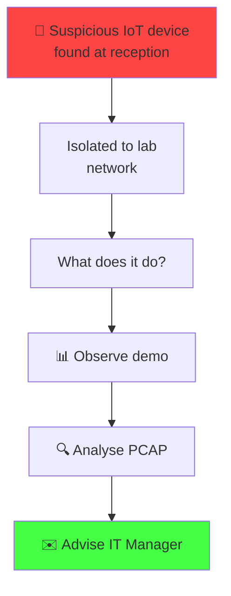
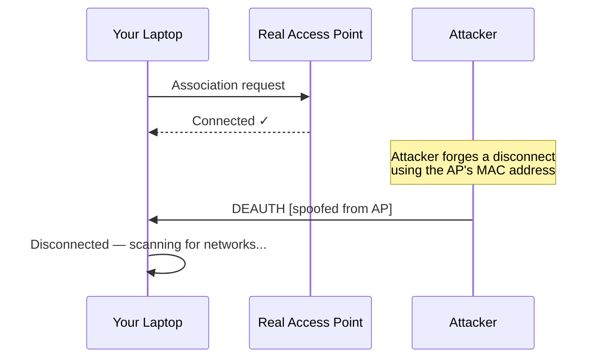

# Week 8
## Rogue IoT Device: WiFi Threat Analysis

ICTSAS214 · ICTSAS305 · Redback Systems SOC · Lab Session

---
layout: default
---

# Mission Brief

**Incident Reference:** RBS-2025-008

A suspicious device was found plugged into a USB power point near the reception desk.

It looks like a small circuit board — possibly a modified phone charger.

**Your job today:**

- Understand what destructive firmware can do on a WiFi network
- Observe a live demonstration of the attack
- Analyse packet capture evidence
- Advise management on the threat and remediation

---
layout: default
---

# The Problem: Unprotected WiFi Management

WiFi uses **management frames** to handle connecting, disconnecting, and roaming.

In WPA2, these frames are **not authenticated**.

---
layout: default
---

# Why This Works

Your device has **no way to verify** the disconnect came from the real AP.

It just obeys.

**The device:**
- Scans for networks
- Sees "REDBACK-LAB" with stronger signal
- Associates with the attacker's rogue AP instead
- No warning. No notification. Just happens.

**Result:** Attacker can now intercept all your traffic.

---
layout: default
---

# What an Attacker Can Capture

Once a device connects to the rogue AP, the attacker sees **everything**:

**Credentials**
- Username/password submissions
- Login tokens
- API keys in headers

**Session data**
- Browser cookies
- Authentication tokens
- Session IDs

**Network traffic**
- DNS queries (reveals what sites you visit)
- Email in plaintext (if not TLS)
- Messaging apps without E2E encryption
- Unencrypted HTTP traffic

**The trap:** HTTPS protects the *content* of a connection, but the attacker still sees:
- That you're connecting somewhere
- What domain you're connecting to
- Timing and volume of traffic

---
layout: default
---

# Real World: Operation Fancy Bear (APT28)

**Case Study:** Hotel WiFi Attack

- APT28 (Russian state threat group) deployed similar attacks at hotel chains
- Targeted government and business travellers
- Devices automatically connected to the rogue "Hotel WiFi" network
- Captured credentials and confidential documents

**Timeline:**
- 2015–2018: Multiple campaigns documented
- Targets: NATO countries, Eastern Europe, Central Asia
- Method: Rogue AP + SSL stripping + credential harvesting

**Result:** Compromise of diplomatic and corporate networks.

---
layout: default
---

# The ESP8266 Deauther

The device recovered from Redback Systems reception is an **ESP8266 microcontroller** running **deauther firmware**.

**Why this matters:**

| | |
|---|---|
| **Cost** | ~$10–15 AUD for the hardware |
| **Firmware** | Freely available on GitHub |
| **Capability** | Full 802.11 attack suite (scan, deauth, rogue AP) |
| **Setup time** | Minutes (web UI, no CLI needed) |
| **Detection difficulty** | High — looks like a phone charger |

**It is destructive software running on a compromised IoT device.**

---
layout: default
---

# WPA2 vs WPA3

**WPA2 (everywhere):**
- Management frames **not authenticated**
- Deauth attacks work perfectly
- No protection against rogue APs beyond user vigilance

**WPA3 (emerging):**
- Uses Protected Management Frames (PMF / 802.11w)
- Management frames are **cryptographically signed**
- Client can verify frames come from the real AP
- Deauth attacks **don't work**

**The gap:**
- Most consumer devices still run WPA2
- Enterprise rollout of WPA3 is slow
- Billions of devices remain vulnerable

---
layout: default
---

# Protecting Against This Attack

**For Users:**
- ✅ Use a VPN on any untrusted WiFi (encrypts everything)
- ✅ If WiFi unexpectedly drops and reconnects → be suspicious
- ✅ Check network name carefully (two identical SSIDs = red flag)
- ✅ Disable auto-connect to open networks

**For Organisations:**
- ✅ **Deploy 802.11w (PMF)** on all APs — fixes the vulnerability at the protocol level
- ✅ Issue and mandate VPN clients for all staff
- ✅ Physical security: monitor for unknown devices in public areas
- ✅ Deploy a **WIDS** (Wireless Intrusion Detection System) — detects duplicate SSIDs and deauth floods

**For the Network:**
- ✅ Segment guest WiFi from corporate entirely
- ✅ Use **802.1X certificate authentication** — devices verify AP's identity before connecting

---
layout: default
---

# What You'll Do Today

## Part 1 — Observe (30 min)
Watch a live demonstration of the device attacking the lab network.

**You will:**
- Experience your device being deauthenticated
- See the rogue "REDBACK-LAB" appear in your network list
- Understand what the attacker is doing in real time

## Part 2 — Analyse (30 min)
Open a packet capture in Wireshark.

**You will:**
- Find deauthentication frames
- Find rogue AP beacon frames
- See the evidence of the attack at the frame level

## Part 3 — Advise (25 min)
Write an advisory memo to the IT Manager.

**You will:**
- Document what happened
- Explain what was captured
- Recommend defences

---
layout: default
---

# Key Takeaway

**The vulnerability is not in the hardware. It's in the protocol.**

WPA2 was designed in the 1990s when the threat model was simpler. Today:

- **A $10 device can compromise a corporate network**
- **It takes minutes to deploy**
- **Most organisations are still vulnerable**

Your job in cybersecurity:
- Understand the threat (✓ you're learning that now)
- Communicate the risk (✓ you'll do that in your memo)
- Recommend the fix (✓ PKI, PMF, VPN, segmentation)

Management listens to competent advisors. Today you become one.

---
layout: default
---

# Questions Before We Start?

The lab session markdown has all the detailed instructions.

Today's slides are **theory**.

The practical work is in the session file you'll follow.

**Ready?**

Go to: `docs/sessions/session-08.md`
